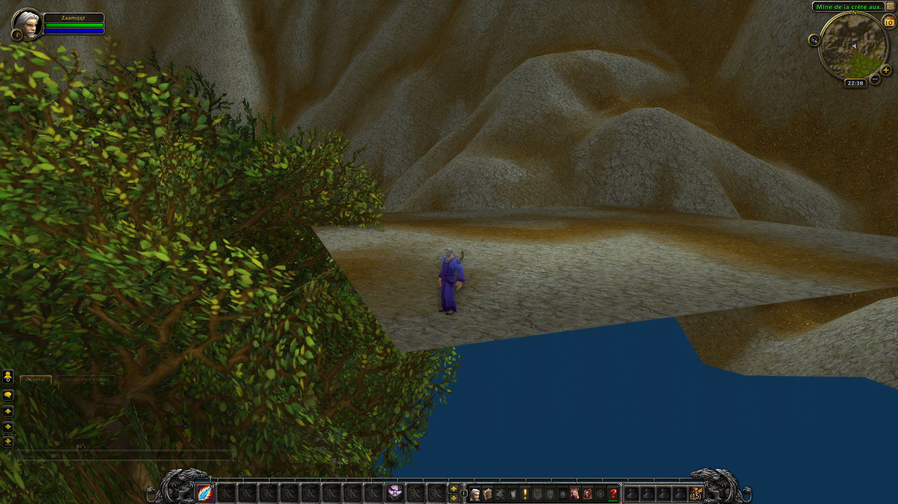

# Modification du terrain en mémoire

::: info
Cette revue est écrite bien des années après sa réalisation, il me manque donc beaucoup d'éléments comme la démarche exacte et tous les logiciels utilisés à l'époque.
:::

> "🎵 Ça plane pour moi..."

## Contexte

- Date : Octobre 2014
- Programme : Wow (serveur officiel)
- Version : 5.5.1
- Outils utilisés : [Cheat Engine](../../outils/memory-editors/index.md), `extracteur d'archives MPQ`

## Objectif

Après avoir vu des vidéos de modification de terrain directement ingame (façon map editor), je voulais voir s'il était possible de se servir des informations du maillage chargées en mémoire pour modifier les coordonnées des points.

Pour commencer je voulais juste voir dans quelle mesure il était possible de modifier un simple point manuellement et, si c'est concluant, en faire un outil pour modifier le terrain autour du joueur (peut être en récupérant les coordonnées du curseur via l'option "Click to move" qui permet d'obtenir des coordonnées 3D dans le monde à partir du curseur).

## Hypothèses initiales

Le terrain doit être chargé quelque part en mémoire, si je positionne mon personnage sur un pic de maillage, je devrais pouvoir retrouver ses coordonnées quasi exactes en mémoire pour me mener aux données du terrain.

## Méthode

### 1. Recherche de la donnée

J'ai pu retrouver les coordonnées en mémoire et en explorant la zone mémoire (`browser memory region`) j'ai pu visualiser l'ensemble du fichier chargé.

### 3. Modification ou patch

A partir de là, j'ai pu écraser toutes les valeurs de hauteur et les mettre au même niveau pour avoir un carré tout plat.

Par contre je ne me souviens pas si j'ai modifié manuellement toutes les valeurs en mémoire (je crois qu'il n'y en a pas tant que ça) ou si j'ai utilisé un utilitaire externe pour générer un chunk plat et écraser les données mémoire via Cheat Engine par celui-ci.

## Résultat

_Un chunk de fichier ADT (fichier contenant le terrain) dont chaque point a été mis à la même hauteur._

### Ce qui a fonctionné

On peut bien remodeler le terrain depuis la mémoire du jeu, je pense que l'on doit pouvoir aller plus loin comme faire des trous et autre en modifiant les autres paramètres du fichier ADT chargé.

### Limites

Le terrain n'est pas modifié en direct. Le fichier chargé en mémoire est modifié mais il faut le recharger pour que le rendu se fasse sur le nouveau modèle (probablement car c'est Direct3D qui a les données utilisés pour le rendu sans sa propre mémoire ? Le fichier ADT ne sert qu'à stocker les données pour les charger après tout).

Pour forcer un rechargement du terrain, passer les graphismes en `low` puis en `high` suffisait sur cette version du jeu.

## Ce que j'en retiens

Ce n'est pas parce que la donnée est chargée en mémoire que l'affichage va la prendre en compte directement. Il ne faut pas oublier que les données peuvent être séparées de la couche de rendu et qu'un hook Direct3D peut être nécessaire pour agir sur ce qui est réellement affiché à l'écran.

## Références

- Documentation sur les fichiers ADT et ses composants : https://wowdev.wiki/ADT

