# Conversion d'un modèle .M2 vers .STL

## Contexte

- Date : Mai 2022
- Programme : World of Warcraft
- Outils utilisés : [WowModelViewer](https://wowmodelviewer.net/download/), [Blender](https://www.blender.org/download/), [WowHead](https://fr.wowhead.com/items), [3DBuilder](https://apps.microsoft.com/store/detail/3d-builder/9WZDNCRFJ3T6?hl=fr-fr&gl=FR)

## Objectif

Suite à une demande, je veux voir s'il est possible de convertir un modèle 3D de World of Warcraft vers un format imprimable. N'ayant moi même pas d'imprimante 3D je ne pourrais pas tester jusqu'au bout cette théorie.

## Hypothèses initiales

WowModelViewer semble être le logiciel adapté, il peut lire les modèles 3D du jeu, les afficher, permettre de customiser les personnages, et même exporter en format 3D plus classique (comme de l'`obj`).

C'est aussi un logiciel très utilisé dans les machinimas.

## Méthode

### Wow Model Viewer

::: warning A props de Wow Model Viewer
Ce logiciel n'est plus mis à jour et est même totalement est déprécié en 2026. Son successeur est [wow.export](https://www.kruithne.net/wow.export) et est activement maintenu !
:::

#### Utilisation
- Choisir un personnage (ou autre modèle 3D)
- Pour les personnages, prendre le nom qui se termine en **\_hd** et pas en **\_hd\_sdr** :  
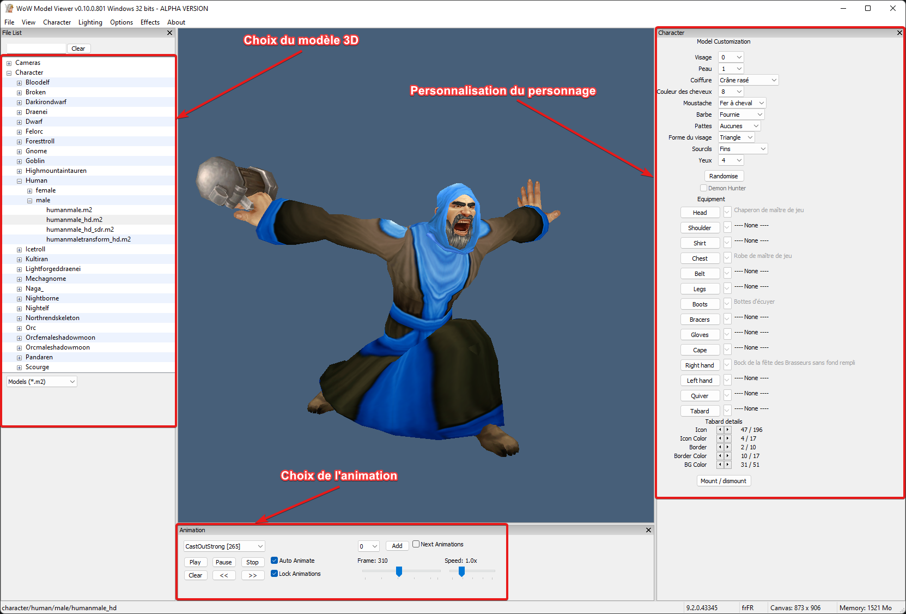

#### Export du modèle 3D
- Exporter le modèle au format **.obj** :  
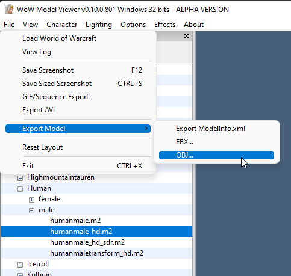

### Blender
#### Utilisation

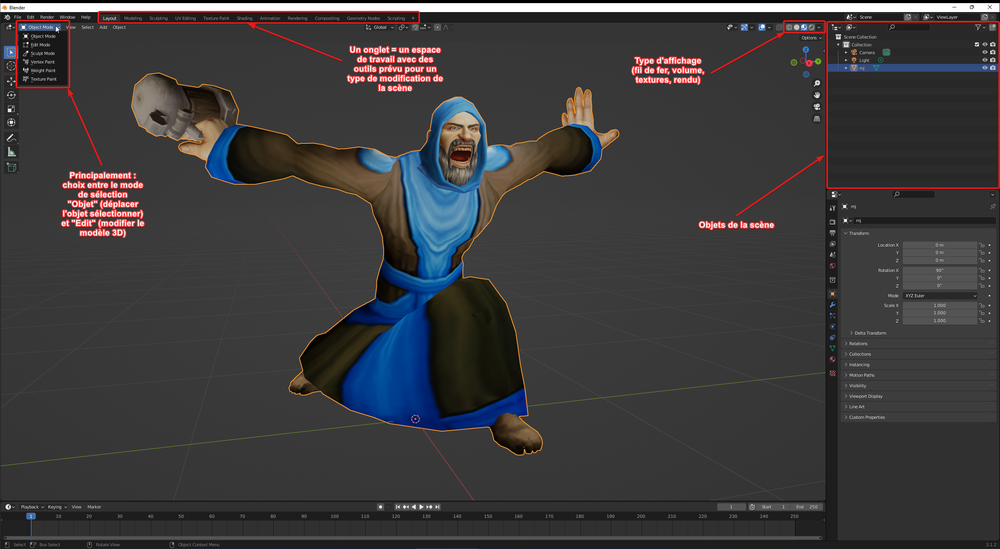

##### Général
| Commande | Description  |
| -------- | ------------ |
| Clic molette | Tourner la caméra |
| Maj+Clic molette | Bouger la caméra |

##### Mode Édition
| Commande | Description  |
| -------- | ------------ |
| Maj+Sélectionner | Ajouter à la sélection |
| Ctrl+Sélectionner | Soustraire à la sélection |

#### Import du modèle
- Commencer par supprimer le cube qui est créé par défaut
- Importer le modèle 3D exporté auparavant :  
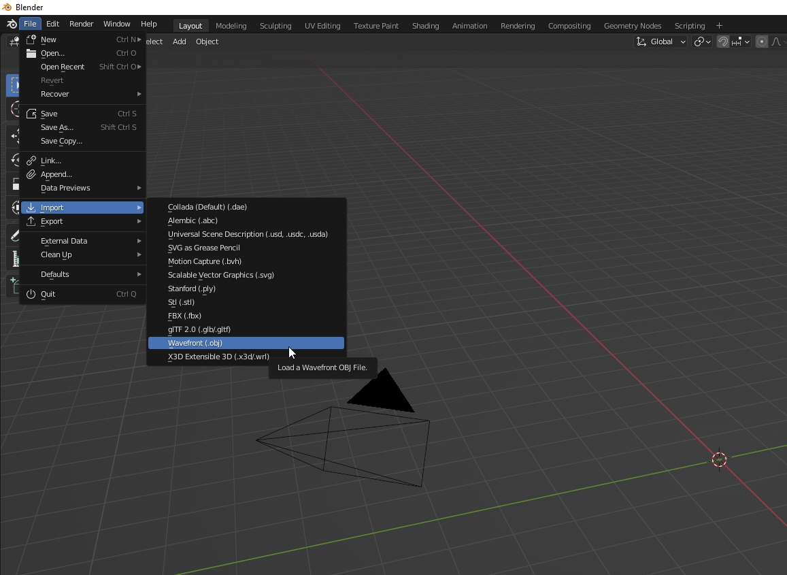

#### Correction du modèle
- Le modèle peut avoir des problèmes suite à l'export, pour vérifier ça, on passe en mode édition (Edit Mode), on se met en type de sélection "Face", on clic sur une face du modèle et on la déplace :  

- Un exemple de modèle corrompu (les faces ne sont pas reliées en elles) : 
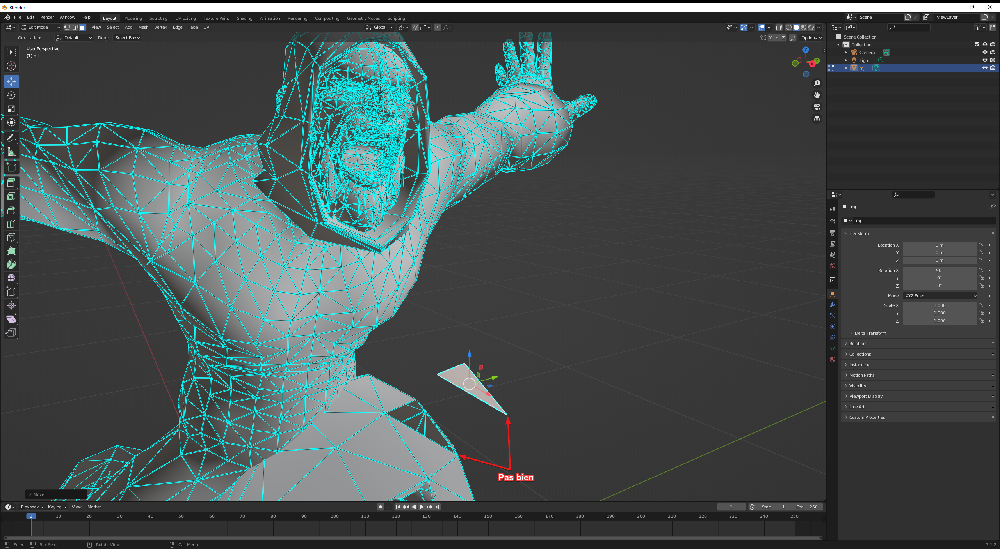
- Pour corriger ce problème : 
  - Passer en mode de sélection "Points"
  - Faire "A" (*Sélectionner tous les points*)
  - Faire "M" (*Merge vertices*)
  - Faire "B" (*By distance*)
- Un message devrait apparaître pour confirmer la fusion des points qui sont superposés :  

- On déplace une face pour confirmer qu'elle est bien attachée au reste :  
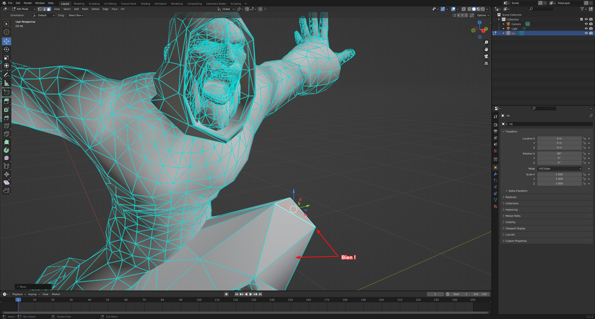

#### Lisser le modèle
- Sélectionner les faces que l'on veut lisser (voir tout sélectionner avec la touche "A")
- Ici je choisi tout sauf le visage qui est déjà très détaillé
- Faire clic-droit -> "Subdivide"

- Les options pour la division vont s'afficher en bas à gauche de l'écran :  

- Maintenant que le modèle a plus de faces, on peut les lisser (toujours avec les faces que l'ont veut lisser sélectionnées) :  
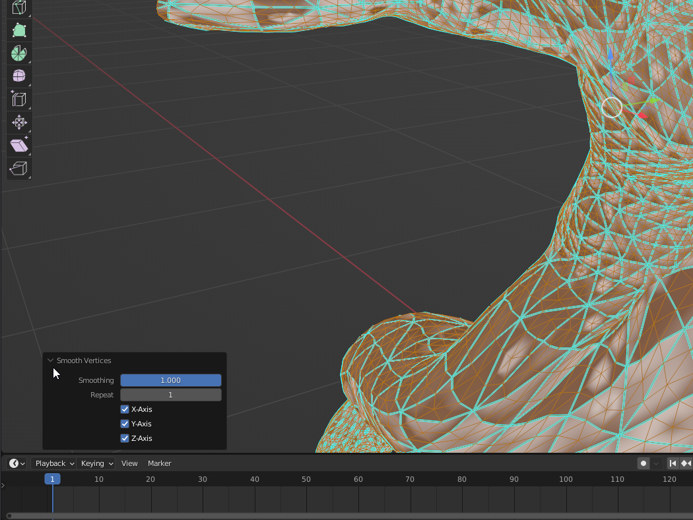
- "Mais ! Mon modèle est devenu tout dégueulasse en rendu !"  

- Alors déjà ça donne un style, et ensuite oui mais c'est facilement fixable ! Ce sont les normales des faces qui ne sont plus correctement alignées et donc le calcul des ombres se fait mal
  - Sélectionner toutes les faces du modèle
  - Menu "Mesh" -> "Normals" -> "Recalculate Outside"
  - Puis menu "Mesh" -> "Normals" -> "Set from faces"
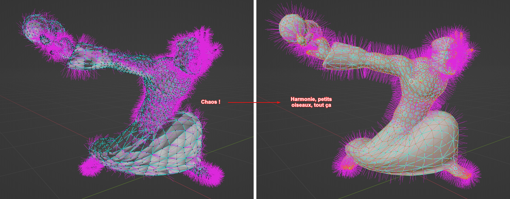
- ⚠️ Les slicer tiennent compte de la normale des faces pour l'impression ! Il est important de corriger le sens des normales avant l'export.

- Résultat du lissage :  
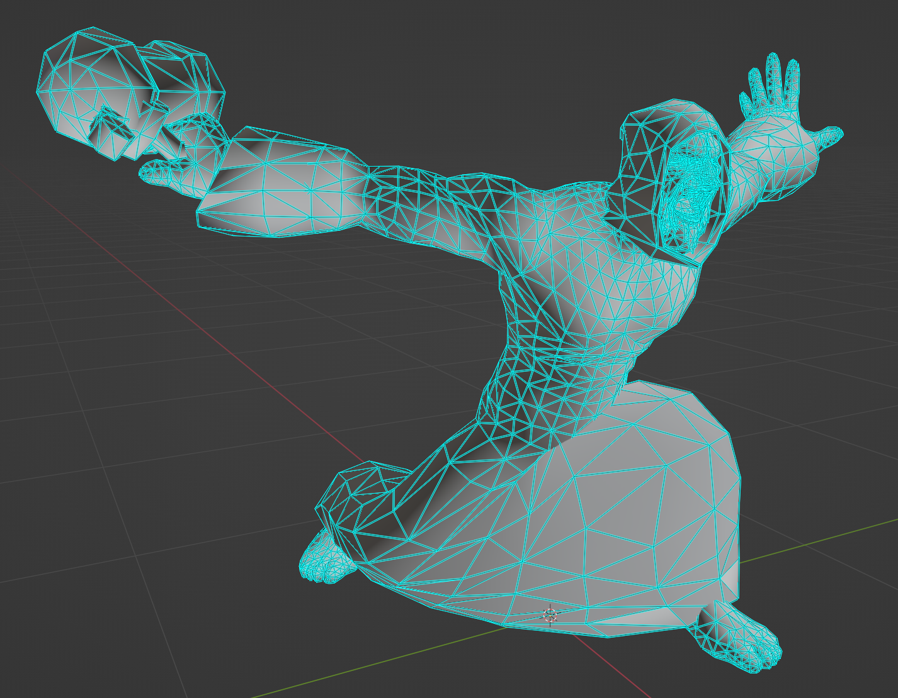

#### Exporter le modèle au format STL

Il faut maintenant exporter le modèle depuis Blender et l'importer dans 3D Builder pour qu'il soit préparé à l'impression et mis aux dimensions voulues

##### Blender
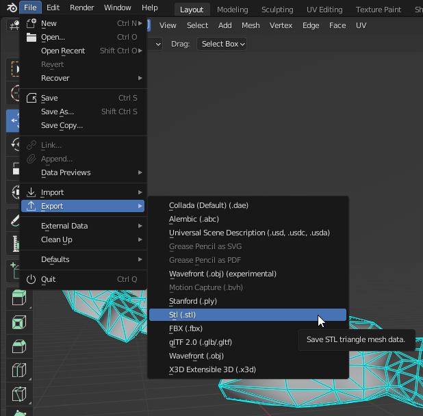

##### 3D Builder
- Importer le modèle STL dans 3D Builder
- Cliquer sur le warning de correction du modèle qui apparaît en bas à droite :  
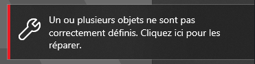

Le modèle peut être déformé après la correction effectuée, vérifier s'il est toujours correct.

- Cliquer sur le modèle pour le redimensionner :  
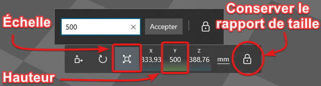

- Une autre option intéressante du logiciel est de rendre le modèle creux :  
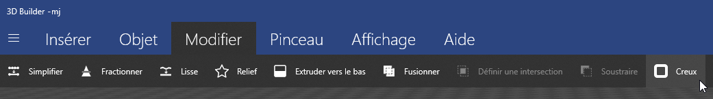

## Résultat

### Ce qui a fonctionné

On arrive à obtenir un modèle 3D propre et compatible avec les slicers.

###  Limites

Bien que le modèle soit théoriquement imprimable, il faudrait sans doute retoucher pour épaissir certaines parties trop fines que le slicer ne pourrait pas prendre en compte.

## Ce que j'en retiens

Ça me semble tout à fait jouable de prendre une base de modèle 3D issu de WoW pour l'imprimer ensuite.
