> "On va avoir besoin d'un plus gros bateau."

# Bidouilles sur Call of the Wild - The Angler

## Contexte

- Date : Juin 2024
- Programme : Call of the Wild - The Angler
- Version : Epic Games Store (numéro de version exact inconnu)
- Outils utilisés : [Cheat Engine](../../outils/memory-editors/index.md), [ReClass.NET](../../outils/memory-editors/index.md), [Deca](https://github.com/kk49/deca) (b595)

## Objectif

Mon objectif initial était de trouver un moyen de sortir de la carte. Lorsque l'on essaye de sortir de la zone de jeu, un timer de quelques secondes se déclenche et on est téléporté en arrière.

## Hypothèses initiales

Je ne sais plus ce que je cherchais initialement mais je voulais fouiller les fichiers du jeu.

Je suis tombé sur l'utilitaire suivant https://github.com/kk49/deca qui permet d'extraire les fichiers des jeux sur le moteur Apex (Just Cause, Mad Max, Call of the wild...). Alors l'extraction m'a pris 44min 22s (pour un peu plus de 40 Go de données générées) et elle comporte des erreurs mais ça vaut le coût.

En explorant un peu les fichiers du jeu, je suis tombé sur la heightmap de la première carte du jeu et un détail m'a intrigué :


Cette marque là, elle veut dire qu'une zone toute plate, rectangulaire, et probablement volante, existe au milieu des montagnes, c'est quand même pas banal. Ça fait penser à une zone de tests pour les développeurs, et c'est trop intrigant pour ne pas lui rendre une petite visite !

On devine une espèce de piste ou juste un glitch de terrain plat sur cette autre map :


_Ça a l'air vachement moins intéressant vu sur cette image mais trop tard, je dois y aller !_

## Méthode

### 1. Observation initiale

On va se rendre au sud de la map et voir déjà ce qu'il se passe si on tente d'y aller comme ça. On se retrouve très rapidement avec un timer de 5s qui nous téléporte en arrière si on ne revient pas dans la zone de jeu.

On va commencer par dégager ce timer et voir si d'autres blocages s'ensuivent.

### 2. Recherche du timer

Le timer dure `5s`, comme il s'agit d'un timer, je suppose que la variable sera en `float` car c'est le format habituel en code pour les mesures de temps (éventuellement en `double` si ça avait besoin d'être d'une précision délirante mais normalement dans les jeux on ne gaspille pas de la mémoire pour rien).

On va préparer une recherche de valeur avec les paramètres suivants :
- Scan Type : `Value between...`
- Value : `4` et `5`
- Value Type : `float`

**Très important** :
- Cocher `Pause the game while scanning`
- Cocher `Enable Speedhack` et le mettre à 0.25 **et faire `Apply`**


::: info Explication sur la recherche
On sait que le timer démarre à 5, donc à peine on aura un pied en dehors de la limite, sa valeur sera inférieur à 5. On doit donc chercher une première valeur entre 4 et 5.

On va ensuite continuer de filtrer ces valeurs en cherchant celles qui ont décrémenté (`Decreased value`) mais pour nous laisser du temps, on met le speedhack à 0.25 pour ralentir le jeu **et** on met le jeu complètement en pause lorsque Cheat Engine fouille dans la mémoire.

Ça nous laisse la possibilité d'envoyer plusieurs scan de type `Decreased value` pendant que le timer passe de 5 à 0.
:::

Au final j'arrive à obtenir une liste très réduite de seulement 56 résultats dont un d'entre eux a pris une valeur intéressante quand le timer s'est terminé :


On la met de côté pour tester en donnant une autre valeur et en la **figeant** (on coche la case).


Bingo ! C'est bien la valeur du timer. On va chercher son pointer pour la retrouver facilement.


_Je ferais sûrement un petit article dédié à la recherche de pointers_

On prend le premier pointeur étant donné que tous les autres en `140` + `28C` nous ajoutent juste un passage par un autre objet en mémoire pour atteindre le même endroit.


On a sécurisé le timer, on pourrait sortir de la map et aller chercher cette zone si intrigante. Mais pour avoir essayé, c'est VRAIMENT LOIN. Il y a une surface énorme de map générée et inutilisée. Et elle est remplie de cailloux et de branchages ce qui la rend impraticable en véhicule. Le tout avec le **bip bip bip** du timer dans les oreilles pendant tout le voyage.

En plus, on sait déjà que la plateforme recherchée est placée très haut (elle est de couleur verte sur la heightmap, ce sont les points les plus élevés) donc sans pouvoir se téléporter ou sauter très haut, on sera sûrement bloqué en bas.

### 3. Recherche des informations du joueur

Vous allez comprendre à quel point le fait d'avoir extrait les données du jeu va nous aider à faire un pas de géant.

En fouillant les fichiers, je tombe là dessus : `/editor/entities/tune/characters/tortoise/tortoise_locomotion.mtunec`


On a juste **le type de données et les valeurs de toutes la variables** qui concernent le déplacement du joueur... C'est jackpot !

::: tip Pourquoi y'a écrit "Tortoise" ?
J'ai l'impression que l'équipe de développement utilise SVN pour synchroniser son code source et TortoiseSVN est un client SVN très utilisé. En gros SVN permet de mettre en commun et faire le suivi de version de fichiers un peu à la manière de Git. SVN est ancien mais peut rester pertinent pour synchroniser des fichiers binaires (là où Git ne servirait à rien car trop de choses changent à chaque recompilation d'un binaire).

Après c'est une supposition, je peux tout à fait me tromper mais pour moi soit on parle de TortoiseSVN, soit c'est un nom interne pour un élément de leur moteur. **Dans tous les cas, ce n'est pas parce que ça parle de tortue terrestre qu'il faut le mettre de côté automatiquement !**
:::


Maintenant qu'on a ces valeurs, **comment les retrouver en mémoire** ? C'est vrai ça, ce n'est pas comme pour le timer qui défilait tout seul et changeait de valeur. Là ces valeurs, ce sont des paramètres qui ne bougent jamais. 

On va procéder différemment : rechercher une suite de valeurs qui sont contigus en mémoire.

On va chercher à retrouver la séquence suivante :
`1.50 1.50 15.0` `3.0 3.0 30.0` (donc les `WalkParameters` suivi des `JogParameters`)

::: tip
On pourrait pousser jusqu'à mettre toute les valeurs de la structure retrouvée dans `decaGUI` mais on va y aller doucement quitte à trouver trop de résultats.

Le risque ici est de ne trouver aucun résultats car le fichier extrait n'est peut être pas une représentation exacte de ce qui se trouve en mémoire, peut être qu'il y a des données ou padding entre les sections, etc. Dans l'idée il vaudrait même mieux commencer par une seule section (comme `WalkParameters`) mais pour avoir déjà testé, je sais que Walk + Jog vont fonctionner.
:::

On va utiliser la recherche par tableau d'octets (`Array of byte`) pour rechercher nos valeurs. Mais pour ça il va falloir transformer nos nombres à virgule normaux en nombre à virgule **hexadécimaux**.

Il existe plein d'outils pour ça, j'utiliserai celui de [gregstoll.com](https://gregstoll.com/~gregstoll/floattohex/) qui va très bien.

Petite configuration :
- On n'a pas besoin des détails de calculs donc on décoche `Show details` (c'est optionnel)
- On coche `Swap to use big-endian` (c'est **obligatoire**)

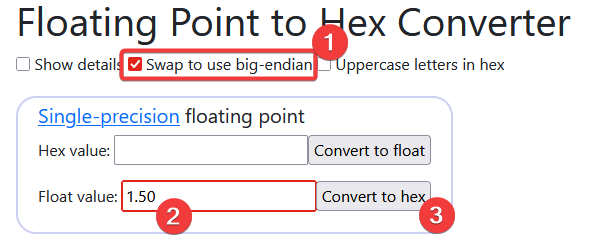

:::: info
Petit aparté sur la notion de `big-endian`. Il s'agit de l'ordre dans lequel ce qui compose une valeur est écrit en mémoire.

Concrètement, pour le nombre `1.50` :
- Représentation hexadécimale `little-endian` : `0x3fc00000` (Le bit de poids fort est situé à l'octet avec l'adresse mémoire la plus petite, `3f` prend le tout premier octet)
- Représentation hexadécimale `big-endian` : `0x0000c03f` (Le bit de poids fort est situé à l'octet avec l'adresse mémoire la plus élevée, `3f` prend le tout dernier octet)

Et en mémoire, en recherche par octets, la donnée est représentée en `big-endian`.

::: info Pour aller un peu plus loin
Une grande partie des OS x86/x64 connus (dont Windows, Linux ou Mac OS X) sont en `little-endian`. **MAIS** pour autant, le stockage des float en mémoire reste sous *la forme* `big-endian`. C'est la norme *IEEE 754* qui définie cette convention d'écriture pour les floats.

C'est pour ça que même sur un OS little endian, on va devoir rechercher le float sous sa forme big endian.
:::

::::


Du coup, faisons notre petite conversion :

| float | hexadécimal |
| ----- | ----------- |
| 1.50  | `0000c03f`  |
| 1.50  | `0000c03f`  |
| 15.0  | `00007041`  |
| 3.00  | `00004040`  |
| 3.00  | `00004040`  |
| 30.0  | `0000f041`  |

On met tout bout-à-bout et on peut faire notre recherche par tableau d'octets dans Cheat Engine : `0000c03f0000c03f0000704100004040000040400000f041`

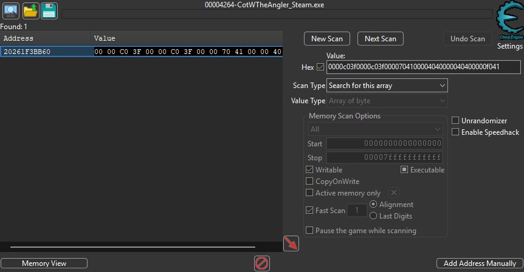

Une seule valeur ressort ici, j'ai constaté qu'habituellement j'en avais plutôt 2. Il faudra les tester pour savoir laquelle fonctionne vraiment.

Maintenant il faut comprendre que l'adresse trouvée est l'adresse du début de la structure `locomotion` que nous avons vu dans les fichiers du jeu tout à l'heure. Ce qui veut dire qu'avec l'adresse trouvée chez moi ça va donner :

| Adresse     | Valeur | Description            |
| ----------- | ------ | ---------------------- |
| 20261F3BB**60** | 1.50   | Walk MaxLinearSpeedMPS |
| 20261F3BB**64** | 1.50   | Walk MaxStrafeSpeedMPS |
| 20261F3BB**68** | 15.0   | Jog MaxLinearSpeedMPS  |
| 20261F3BB**6C** | 3.00   | Jog MaxStrafeSpeedMPS  |
| 20261F3BB**70** | 3.00   | Run MaxLinearSpeedMPS  |
| 20261F3BB**74** | 30.0   | Run MaxStrafeSpeedMPS  |

> Rappelez-vous qu'un float prend 4 octets en mémoire, on doit incrémenter de 4 par 4 pour aller de valeur en valeur (4, 8, C, 10, 14, 18, 1C, 20...)

Un logiciel pratique pour visualiser une structure de ce genre : [ReClass.NET](../../outils/memory-editors/index.md)

On s'attache au processus (comme avec Cheat Engine) :

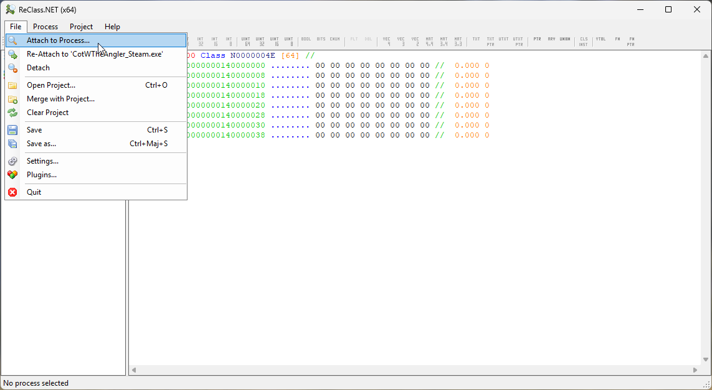

On entre l'adresse trouvée dans Cheat Engine dans la structure par défaut de ReClass :

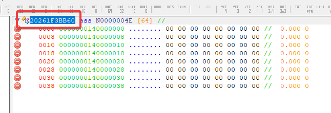

On va ajouter des octets supplémentaires pour être sûr de visualiser toutes les valeurs de la structure `locomotion` (ici j'en ajoute 64, c'est trop mais pas gênant) :

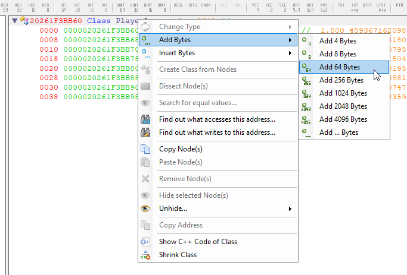

Comme on a vu que notre structure ne contient que des float, on se permet de définir le type de toutes les valeurs à afficher sur float :
- Sélectionner toutes les lignes (1 ligne = 1 valeur lue en mémoire)
- Clic droit -> `Change Type`
- `Float`

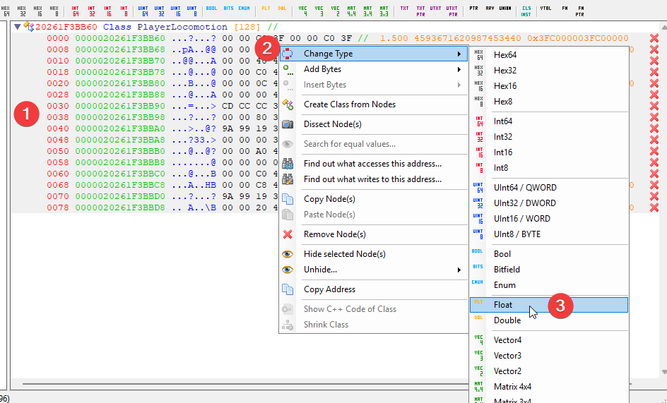

Et on se retrouve avec un affichage de toute la structure avec les valeurs actuellement en mémoire :

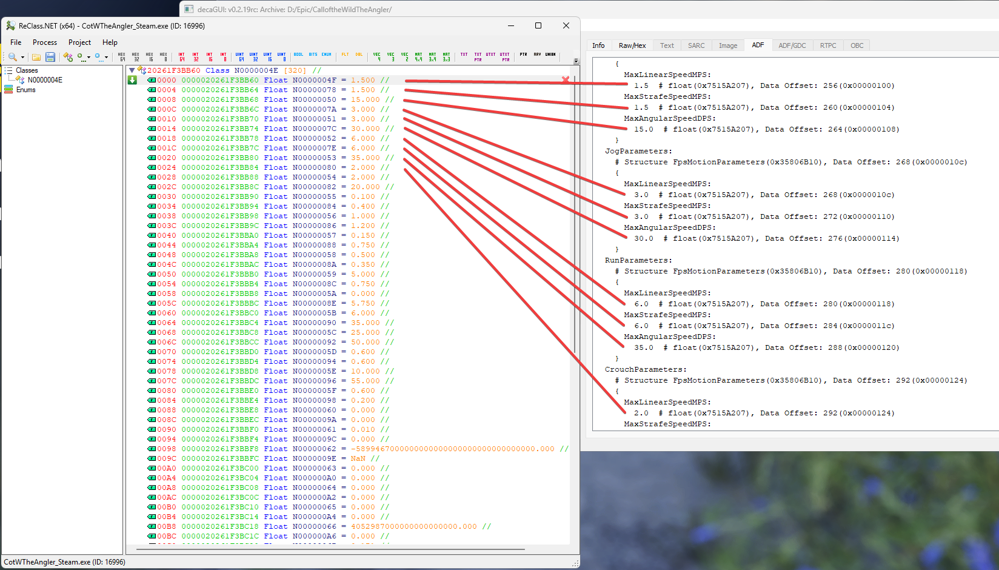

> Là on voit bien que toutes les valeurs se suivent parfaitement, on n'aura pas de mal à naviguer dans celles-ci depuis une adresse parent de base.

::: warning Malheureusement...
Je n'ai pas encore trouvé comment obtenir un pointer vers cette structure... Il faudra donc relancer la recherche à chaque lancement du jeu mais on va quand même tâcher de se simplifier la vie autant que possible dans Cheat Engine.
:::

Créons un entête **avec adresse** dans Cheat Engine en faisant clic droit -> `Create Header` dans la liste des adresses :


De mon côté je le nommerai **Locomotion** suivi de la suite d'octets à rechercher. Comme ça lorsque je relancerai le jeu, je referai ma recherche en tableau d'octets en recopiant cette valeur. Je l'aurai sous la main au lieu de me retaper les conversions de floats.

On accepte de donner une adresse au header (c'est là tout l'intérêt en fait) :

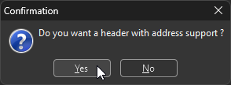

De base l'adresse est à 00000000, on double clic sur l'adresse pour la définir :

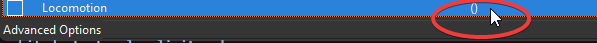

On lui donne l'adresse de la structure trouvée précédemment via la recherche de tableau d'octets (le type n'a aucune importance ici) :

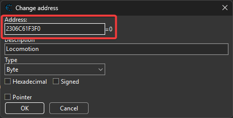

::: tip
Le header nous permet de créer un groupe dont toutes les adresses qui y figurerons pourront dépendre d'une adresse parent.

Concrètement on donne au header l'adresse parent et on se contente de donner un offset (`+4`, `+8`) aux adresses enfants.
:::

Ajoutons une nouvelle adresse et cette fois-ci, on va seulement indiquer `+0` dans `Address` :

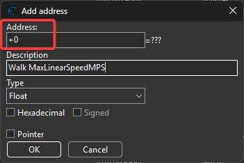

> Pourquoi `+0` ? Car la structure commence à 0 avec la valeur de **Walk MaxLinearSpeedMPS**. Donc notre adresse parent du groupe est aussi notre première adresse utile.

On glisse ensuite notre nouvelle adresse dans le groupe avec un glisser-déposer :

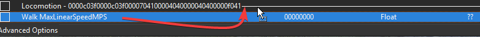

On contrôle que l'adresse est bien placée. Visuellement elle doit être décalée sous le header et elle doit prendre sa valeur de `1.50`.

Pour les adresses suivantes, je me contente de copier/coller celle que l'on vient de déplacer, comme ça les suivantes seront déjà placées ans le groupe, on devra juste changer l'offset et la description :

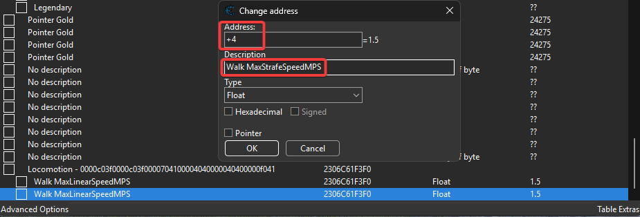

On continue d'ajouter des adresses de 4 en 4 et petit à petit on arrivera à ça :

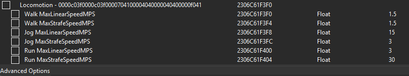

On continue ainsi de suite jusqu'à avoir toutes les valeurs qui nous intéressent (on a déjà les vitesses, il faut aussi choper `JumpSpeed` qui est la hauteur de saut si on veut sauter sur cette satanée plateforme).


### 4. On s'affranchit de toutes les limites !

Pouvoir sauter très haut c'est bien, mais je me suis vite rendu compte que ce n'était pas utilisable car le jeu nous téléporte dans un endroit safe si il détecte que l'on tombe de trop haut...

Je ne sais plus à quelle occasion mais j'ai vu des chaînes de caractères sympa de ce genre :


Mais où se trouve donc ce code qui semble vérifier une hauteur de chute ? Et bien dans la même fonction que la gestion du timer (oui oui !).

Revenons donc à notre timer. On va scanner quelles instructions accèdent à cette adresse (juste pour voir).


Allons voir du côté de la lecture de la valeur du compteur (2ème instruction), on va décomposer ce qu'il se passe :

```asm
# Lecture de la valeur du compteur
CotWTheAngler_Steam.exe+CB4726 - F3 0F10 83 8C020000   - movss xmm0,[rbx+0000028C]

# Décrémente le compteur (xmm10 contient certainement le temps écoulé depuis le dernier appel de la fonction)
CotWTheAngler_Steam.exe+CB472E - F3 41 0F5C C2         - subss xmm0,xmm10

# Comparaison entre la nouvelle valeur du compteur et une autre valeur (certainement 0.0)
CotWTheAngler_Steam.exe+CB4733 - 41 0F2F C0            - comiss xmm0,xmm8

# Mise à jour de la valeur du compteur dans la mémoire
CotWTheAngler_Steam.exe+CB4737 - F3 0F11 83 8C020000   - movss [rbx+0000028C],xmm0

# Saut à l'adresse CotWTheAngler_Steam.exe+CB47EF SI la comparaison faite avant était VRAIE (`ja` = Jump Above, on saute à l'adresse si xmm0 > xmm8)
CotWTheAngler_Steam.exe+CB473F - 0F87 AA000000         - ja CotWTheAngler_Steam.exe+CB47EF
```

Pas grand chose de neuf me direz-vous et c'est pas si faux. Mais on a du détail sur le fonctionnement et on pourrait par exemple très facilement dégager le décrément du timer en remplaçant le `subss` par des `nop`.

Mais on va prendre une vue un peu plus large autour de ce code :


On voit que la partie sautée avec le `ja` comprend une chaîne de caractères `bounds` suivi de l'écriture de la valeur `2`. Ça ressemble à la raison d'une téléportation automatique. C'est le genre d'info qui peut servir a plusieurs niveau :
- log pour debugger ce qui fait se téléporter un joueur 
- envoi de l'information aux serveurs du jeu pour debug ou anti-cheat
- adapter ce qui va suivre : par exemple lorsqu'on est TP car on était dans des eaux trop profondes, on entend la vendeuse nous dire qu'on n'est pas des poissons. C'est con mais il faut savoir pourquoi on a été TP pour déclencher ce dialogue.

En regardant un peu plus haut, on voit un code qui, bien que plus court, semble similaire :
- On lit une valeur
- On la compare
 - Soit on saute à une adresse
 - Soit on passe par une chaîne de caractère `under_world` et on écrit la valeur `4`

On va scroller jusqu'en haut de la fonction. On voit passer d'autres motifs de téléportation : `depth`, `capsized`, `falling`, `forced`... Et un beau jour, on arrive là dessus :


On voit la fin de la fonction située au dessus de la notre (qui se termine avec un `ret` comme `return`) et le début de notre fonction qui démarre sur les chapeaux de roues avec un `mov rax,rsp`.

::: tip
La série de `int 3` qui séparent nos deux fonctions sont des points d'interruption pour les debuggers (breakpoints). Dans l'idée, il ne devrait pas y en avoir sur un binaire de production comme celui-ci. Mais il y a des cas où ils sont tout de même utiles.

Personnellement, je pense que la raison possible la plus probable pour leur présence est qu'ils servent à :
- aligner le code des fonctions pour qu'il fasse une taille bien définie en mémoire et qu'il soit plus facile à mettre en cache
- faciliter l'utilisation de la [prédiction de branches](https://fr.wikipedia.org/wiki/Pr%C3%A9diction_de_branchement) par le CPU

Mais cet avis n'engage que moi.
:::

**Bon, ça commence à faire long alors on va accélérer.**

On remarque très vite un `test` fait au début de la fonction suivi d'un `je` (Jump if Equals).

Le test a l'air bizarre car il compare une valeur avec elle même : `test rdi,rdi` mais c'est en fait un raccourci pratique pour rapidement vérifier si `rdi est null`.

Si c'est le cas, il saute à la toute fin de la fonction (il suffit de suivre le `je` et on se rend compte que l'on arrive tout en bas).

Je ne sais pas ce qui est sensé se trouver dans `rdi` à ce moment, un flag qui s'allume quand le joueur est hors limite ? Un mode debug des développeur qui peut désactiver ces checks ? Peu importe, ça va nous être très utile.

On va inverser la condition et **plus aucun** check ne sera fait.

Pour ça rien de plus simple, on patch `je` en `jne` (Jump if not Equals) :


Et voilà, à nous la liberté !

<YouTubeEmbed video-id="ZgFUXGVGM48" />
_J'vis comme une boule de flipper, qui roule..._

## Résultat

::: info Piste de test des jeeps
La raison pour laquelle je voulais sortir de la map ! Bon au final ce n'est pas très excitant en soit mais c'est grâce à elle que j'ai pu voir tout le reste !

<YouTubeEmbed video-id="QvwSQlGeR3E" />

<YouTubeEmbed video-id="iSU5b3zmXoc" />


_Vue de dessous._


_Il y avait un spawner de véhicules comme on en trouve partout en jeu._
:::

::: info Zone de test des objets
Je ne sais pas encore si ces zones servaient juste à tester les modèles ou si c'est une façon de les faire charger au jeu en une fois au chargement de la map et éviter les freeze si un modèle se ferait charger plus tard (par exemple un joueur qui spawn une voiture avec une couleur que l'on avait pas encore croisé). J'ai déjà vu ce système d'objets déjà créés en dehors de la map qui se retrouvent ensuite instanciés au besoin dans certains moteurs de jeux (oui je parle de toi Construct2).

D'un autre côté les maps ont des éléments d'autres maps (le ferry ici, des éléments Japonais sur la map en Afrique) donc ça doit bien servir à tester également...


_Fun fact : sur ce genre de plateforme j'ai pu voir en avant première les reposes cannes qui ont été introduits quelques mois plus tard en jeu, wow !_


_Ceux là sont clairement des bâtiments de test ou qui n'ont jamais été terminé._


_Il faudrait que je retourne voir cette croix maintenant que le jeu a officiellement été stoppé (mais les serveurs tournent toujours)._


_Update Août 2026 : et bien non, pas de changement_ 😕


_Vues d'ensemble_


_Oui, c'est un ferry qui vole. Le plus étonnant étant que cette carte n'a pas ce genre de bateau, ni le train ni plusieurs autres modèles. Je pense que cette carte servait aussi de test pour les développeurs. C'est la toute première map sortie avec le jeu, celles qui ont suivies étaient des DLC._
:::

::: info Comportement des véhicules
<YouTubeEmbed video-id="eMF2Ku7l1Cs" />
_Petite modification de l'aérodynamisme des véhicules terrestres._

<YouTubeEmbed video-id="ciB6h4sz9Zw" />
_Sans ce coup de lag j'aurai battu mon record..._
:::

::: info Autres curiosités

_Les autres cartes aussi ont eu droit à leurs zones de tests._


_Mon bateau s'est envolé, tout droit à la verticale, après que j'ai joué avec les valeurs d'aérodynamisme_ 🤷‍♂️


_De très beaux paysages même en dehors de la map._


_La bordure de la map._


_La modif sauvage des valeurs de rendu 3D ont fait tomber les feuilles des arbres... Initialement je cherchais à désactiver le rendu de l'eau pour voir les poissons._


_Les poissons ! LES PETITS POISSOOOOOOOOONS !_
:::

### Ce qui a fonctionné

J'ai pu sortir de la map et explorer les zones de test des développeurs, c'était très cool !

Heureusement que des utilitaires pour lire les fichiers du jeu existent pour me permettre de mieux comprendre la structure des données et les retrouver en mémoire.

###  Limites


## Ce que j'en retiens

Je me dis que pour avoir réussi à passer autant de temps et d'énergie à tordre ce jeu, j'ai vraiment dû beaucoup l'aimer ! 240h cumulées entre le vrai jeu et la bidouille **en jeu** (je ne compte pas le temps passé à faire des recherches en dehors).

## Références

- Convertisseur float -> hex : https://gregstoll.com/~gregstoll/floattohex/
- Big/Little endians ("boutisme") : https://fr.wikipedia.org/wiki/Boutisme
