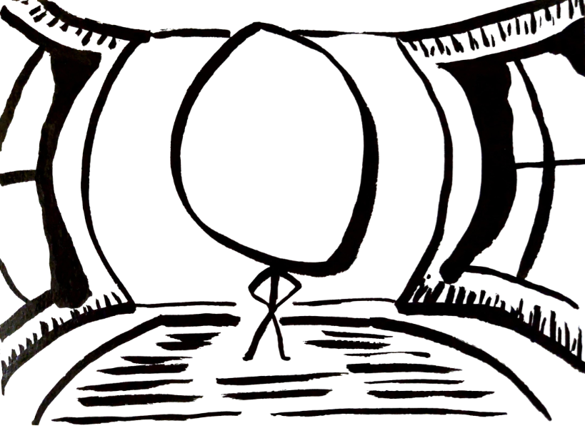

> "De quoi prendre la grosse tête."

# Modification du FOV dans The Last Of Us part 1 (avec pointeurs)

## Contexte

- Date : Août 2026
- Programme : The last Of Us part 1
- Version : 1.1.5.0
- Outils utilisés : [Cheat Engine](../../outils/memory-editors/index.md)

## Objectif

On veut être capables d'ajuster précisément le FOV dans the **Last Of Us part 1** et de conserver la valeur trouvée entre chaque sessions de jeu.

Le but serait d'arriver à conserver la variable entre les lancements en passant par les pointeurs.

Alors on lance le jeu, on démarre Cheat Engine et c'est tipar !

## Hypothèses initiales

La valeur du FOV doit être trouvable assez facilement, le jeu propose un slider pour modifier le FOV, on pourra donc rechercher facilement la valeur dans Cheat Engine.

Le plus compliqué sera de trouver un pointeur valide qui permettra de retrouver cette variable même après avoir relancé le jeu.

## Méthode

### 1. Observation initiale

On lance une partie pour faire la recherche en se simplifiant la vie car on aura la possibilité de changer le FOV en jeu pour nous aider dans notre recherche.

### 2. Recherche de la valeur

On va faire une recherche classique de valeur dans Cheat Engine :
- Il y a de grandes chances que le FOV soit un `float` pour avoir un minimum de flexibilité (pouvoir avoir 75.5 de FOV par exemple). Il y a peu de chances que ce soit un `double` car ça serait ridiculement précis pour le besoin
- Le FOV est certainement plus grand que 0.0

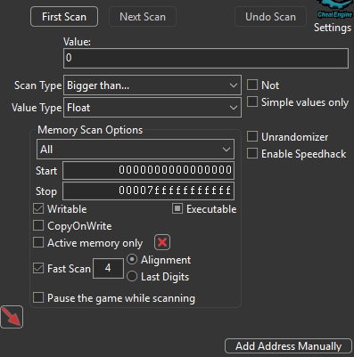

Je fais une seconde passe en enlevant tout ce qui est plus grand que 1000 (je me laisse un peu de marge car on ne sait pas réellement ce que le jeu utilise comme valeur pour son FOV, c'est peut être une autre unité que les °)

Maintenant on va commencer la partie rébarbative. On va dans les options et on modifie le slider de FOV.

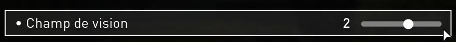

::: danger
Le FOV ne s'applique réellement qu'après être revenu en jeu, il faudra donc :
- Appliquer la modification
- Revenir jusqu'en jeu (on voit le FOV changer à ce moment)
- Faire notre recherche dans Cheat Engine de type `Increased value` ou `Decreased value` (suivant si on a augmenté ou réduit le FOV)
- Rouvrir le menu des options et ainsi de suite...
:::

A un moment vous commencerez à trouver des valeurs qui fleurent bon le FOV :

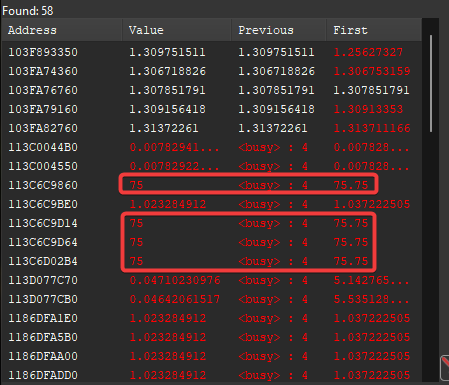

Quand vous commencez à ne plus avoir beaucoup de valeurs possibles (je dirais < 100), vous pouvez vous permettre de toutes les ajouter à votre liste d'adresses, les trier par valeurs et supprimer toutes celles qui ne vous intéressent pas :

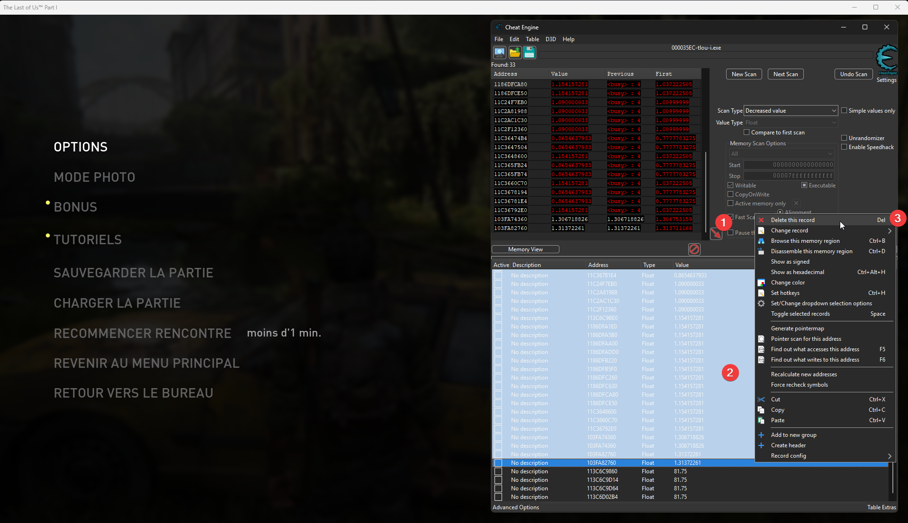

Testez ensuite de modifier les valeurs de chaque adresses restantes pour trouver celle qui agit réellement sur le FOV. **Testez des valeurs cohérentes (par exemple entre 60 et 120) pour éviter un crash du jeu et avoir à tout refaire !**

::: warning Si aucune valeur ne fonctionne
Peut être avez-vous dégagé la bonne valeur au cours de votre recherche (ça m'est arrivé plusieurs fois, je penche pour un de mes filtrages un peu agressif...). Si vous avez au moins une valeur qui correspond au FOV, même si vous ne pouvez pas la modifier, servez-vous en pour faire une **nouvelle recherche** par `Exact value`, ça sera beaucoup plus rapide cette fois-ci car vous aurez juste à chercher la même valeur que la variable trouvée précédemment.

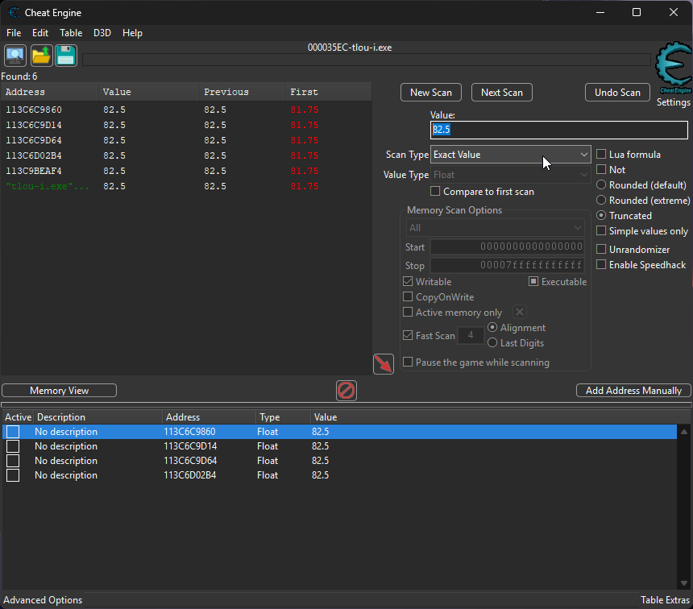
_Par exemple ici je n'avais trouvé que 4 variables alors qu'en cherchant par valeur j'en ai 6_
:::

A ce stade vous devriez avoir une valeur (et donc une adresse) qui permet de modifier le FOV.

::: tip
Si vous pouvez modifier le FOV mais qu'il revient à la normale dès que vous quittez le menu, c'est normal. On verra ça un peu plus tard. Considérez que si visuellement le FOV bouge, c'est la bonne adresse.
:::

### 3. Génération de la pointermap

Pour retrouver la valeur même après avoir quitté le jeu, on va utiliser [les pointeurs](../../fondamentaux/pointers/) (mais ceux là sont sympas). On va commencer par demander à Cheat Engine de générer une map des pointeurs que l'on pourra utiliser ensuite.

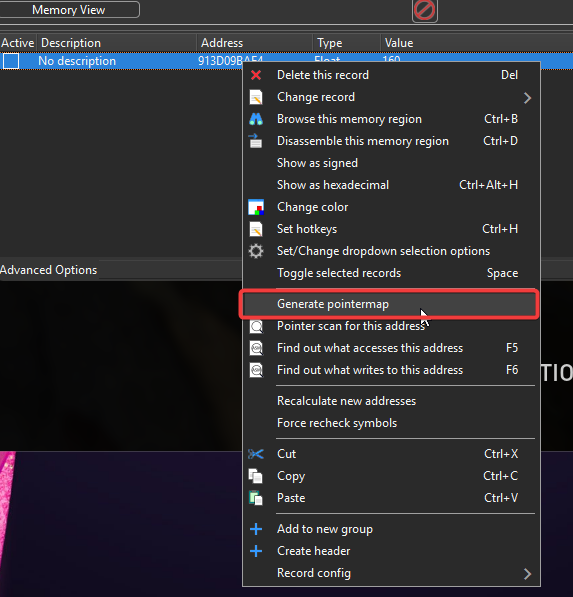

Donnez le nom que vous voulez au fichier, assurez-vous juste d'être capable de le retrouver pour l'étape suivante.

Patientez quelques minutes le temps que la génération se termine (la fenêtre de génération va se fermer toute seule).

::: danger
La génération cette map va **temporairement** prendre plusieurs giga-octets (~5 Go) sur votre disque, assurez-vous d'avoir de la place pendant la génération. Après ça, la carte en elle même ne pèsera qu'une centaine de Mo.
:::

### 4. Recherche des pointeurs valides

Cette fois-ci on lance la recherche de pointeurs sur l'adresse voulue :

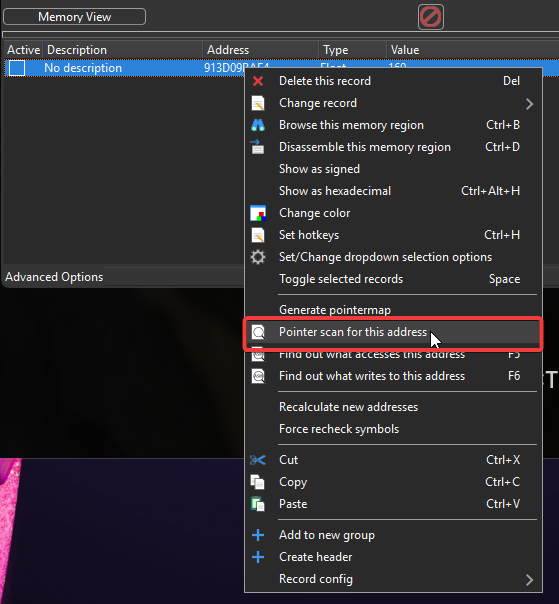

On fourni la pointermap créée juste avant à la recherche :

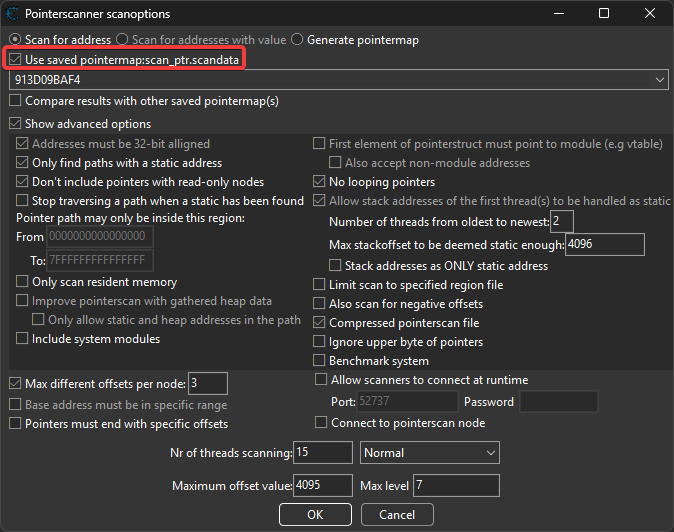
_J'ai peut être des options différentes mais ça devrait fonctionner avec les options par défaut._

On indique un fichier pour enregistrer le résultat du scan et c'est parti !

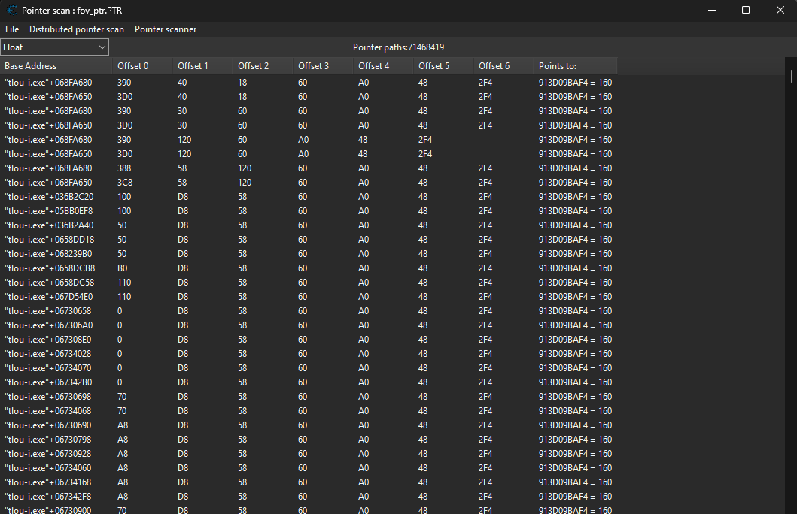

Alors... il y a du monde.

Si vous avez suivi les petits rappels sur [les pointeurs](../../fondamentaux/pointers/), vous devriez vous dire qu'un objet aussi important que la caméra ne devrait pas se trouver très très loin dans le code.
Donc on va trier cette liste pour avoir les résultats avec le moins de sauts (offset/pointeur) en premier. 
Pour ça, on clique sur la dernière colonne d'offset :

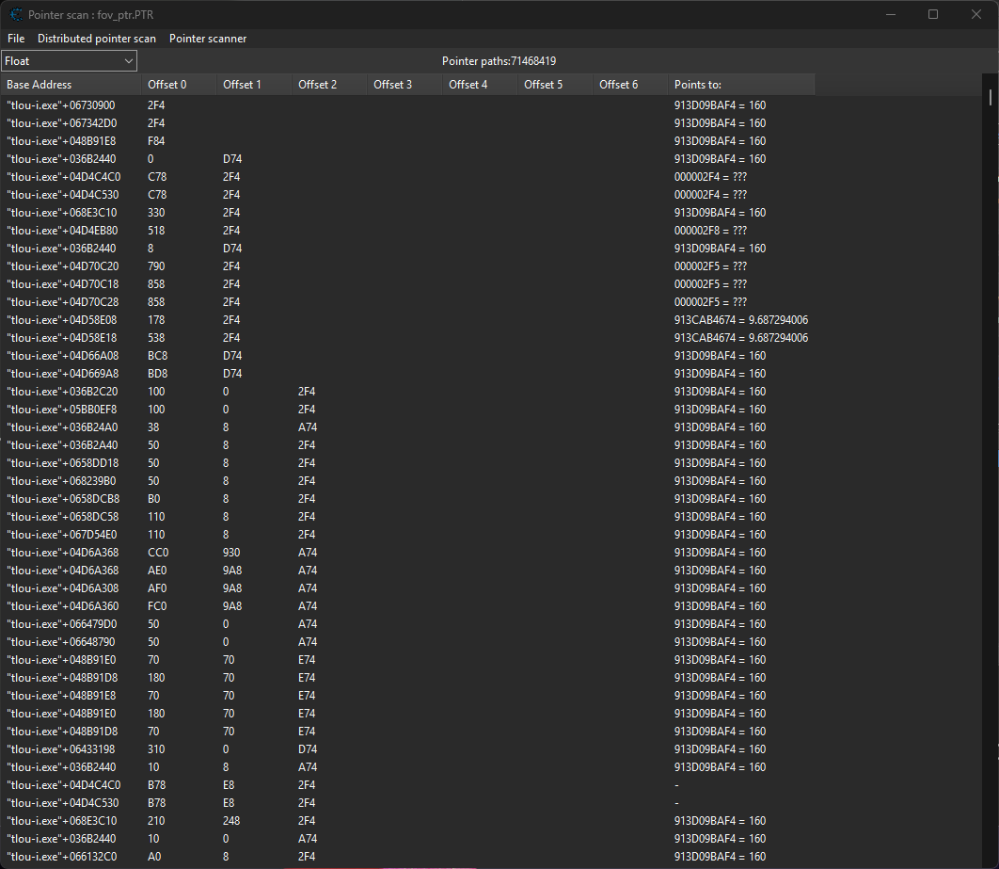

Ça va prendre plusieurs minutes pour trier mais ça vaut la peine d'attendre...

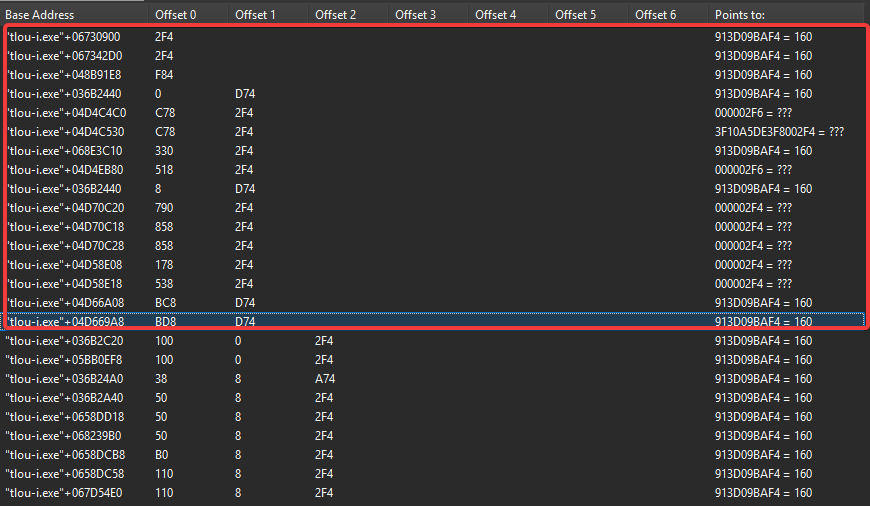

Là c'est BEAUCOUP mieux et ça fait beaucoup moins peur.

On va juste récupérer toutes les valeurs qui ont le moins d'offsets possibles car ce sont celles qui ont le plus de chances de ne pas bouger après un nouveau lancement.

Je vous conseille de vous limiter à ce lot d'adresses :

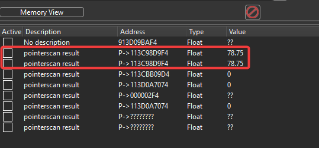

::: tip
Si vous devez refaire un scan après avoir fermé le jeu, vous **devrez refaire une pointer map** avant de relancer une recherche de pointeurs.
:::

Maintenant qu'on a notre liste d'adresse avec pointeurs, on serre les doigts, on croise les fesses et on relance le jeu.

On voit que dans la bataille, deux adresses ont survécus, et on est heureux ☺️

Les deux adresses utilisent des chemins différents pour cibler la même variable, on peut garder l'une ou l'autre sans distinction (ou les deux si vous êtes parano comme moi).

### 5. COOL ! Mais moi le FOV se reset dès que je quitte le menu !!

Alors, oui, bon...

Ça veut dire que quelque chose vient écrire la valeur que le FOV est sensé avoir pendant que le jeu tourne (certainement à chaque frame, ça doit faire partie de la pipeline de rendu de la scène).

On peut ruser en empêcher le jeu de réécrire la variable.

Pour ça on va chercher qui écrit dans la variable :

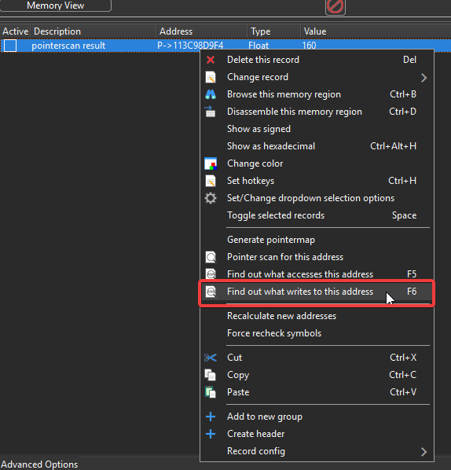

On accepte d'attacher le debugger de Cheat Engine au processus.

::: info
Si vous avez déjà trouvé votre pointer, une fenêtre supplémentaire va s'afficher :

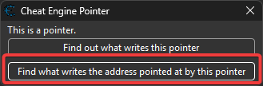

On indique que l'on veut savoir qui écrit dans la valeur à l'adresse indiquée par le pointeur (et non pas qui écrit le pointeur en lui même).
:::

Pas besoin de faire tourner le scan très longtemps, on le tient le saligaud :

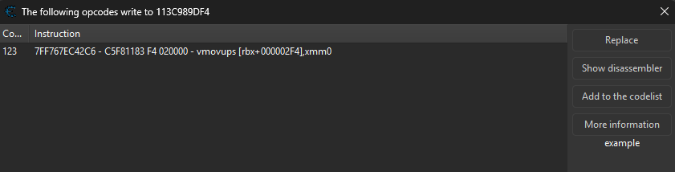

On affiche la vue [désassembleur](../../fondamentaux/desassembler/) :

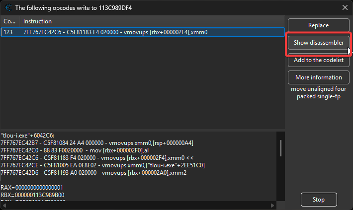

La fenêtre qui s'affiche nous montre le code assembleur et a déjà pré-sélectionné notre coupable. On va le rendre inoffensif en remplaçant son code par du code qui ne fait rien. Il y a justement une instruction assembleur pour ça : `nop` (code hexa 0x90) :

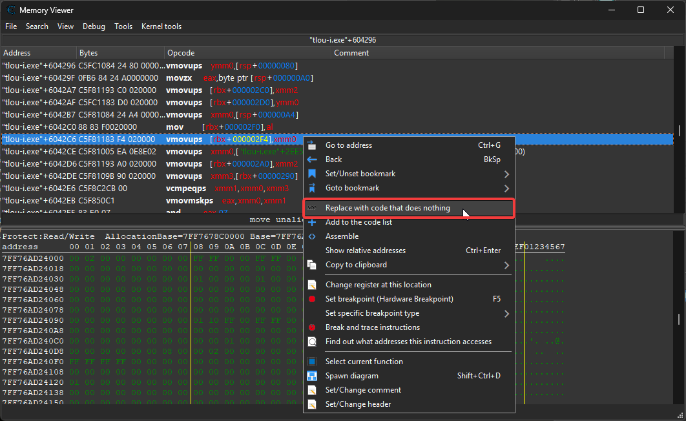

::: tip ℹ️ La vue désassembleur
Elle nous montre le code du jeu (code assembleur interprété par le processeur). Ici on peut :
- suivre le déroulé du code (mais bon courage)
- mettre des breakpoint pour mettre le programme en pause lorsqu'il arrive sur la ligne contenant le breakpoint
- et surtout modifier les instructions assembleur pour changer le comportement du programme
:::

Et voilà ! A partir de maintenant nous sommes les seuls à écrire dans cette variable.

## Résultat

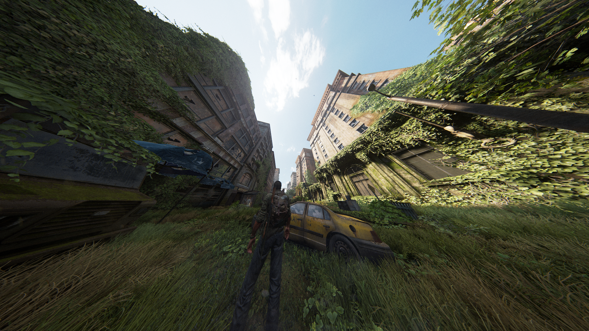
_Test avec le FOV à 160_

### Ce qui a fonctionné

On a réussi à trouver une adresse et un pointeur valide nous permettant de retrouver la valeur du FOV après avoir quitté le jeu.

On a également pu patcher le code assembleur pour empêcher le jeu d'écraser la valeur du FOV par sa valeur à lui.

###  Limites

- Le travail de recherche de pointeur sera certainement à refaire de 0 en cas de mise à jour du jeu
- On a de la chance que le code assembleur de mise à jour soit une mise à jour du FOV uniquement et pas d'autres valeurs. Auquel cas nous n'aurions pas pu simplement remplacer l'instruction par `nop`, il aurait sans doute fallu remonter la chaîne d'instructions et casser l'appel vers cette fonction.

## Ce que j'en retiens

Dans ce cas-ci, trouver un pointeur valide aura été beaucoup plus simple que ce que j'aurai pensé. Il manque toutefois encore une chose : trouver un moyen de patcher facilement le code de mise à jour du FOV pour le désactiver.

## Références

- Les [pointeurs](../../fondamentaux/pointers/)
- Les [désassembleurs](../../fondamentaux/desassembler/)

