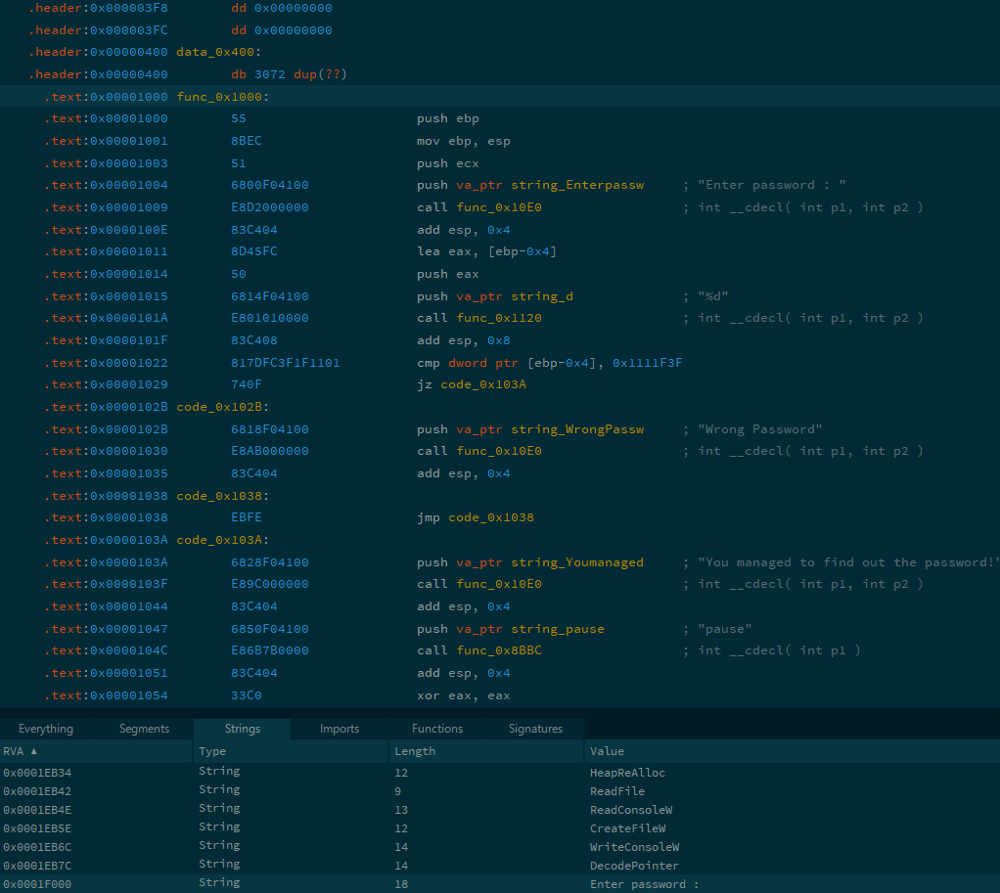

# Désassembler

# Décompiler ou désassembler ?
Pour mettre les choses au clair, la décompilation pure n'existe pas vraiment. Une fois compilé, le code source est transformé en langage assembleur et ne peut pas être décompilé en code source.

C'est le même problème qu'essayer de refaire une vache à partir de steaks hachés.

Ce n'est pas pour autant qu'un code compilé est une boite noire. Là où le steak haché contient des fibres de viandes visibles et reconnaissables, un code compilé contient des instructions assembleur tout à fait lisibles.

# Désassembler
Si on ne peut pas ramener le code compilé à son état d'origine, on peut tout de même visualiser ce que la compilation nous a laissé. Et pour ça on fait appel à un désassembleur. Son rôle est de reprendre le fichier compilé et de nous le traduire en une série d'instructions assembleurs (ils font bien plus que ça en réalité mais passons).

  
_(Exemple d'une partie de programme désassemblé dans **Relyze Desktop**)_

Ici, on parle directement au processeur en utilisant les jeux d'instruction qu'il comprend. C'est beaucoup moins lisible qu'un langage de plus haut niveau mais ça peut dépanner.

# Quelques exceptions
Certains langages permettent la récupération d'un code quasi identique au code source et même du code source complet.

## Langages à machine virtuelle
_Java, langages .Net (VB, C#, ...)_  
Ces langages ne sont pas compilés directement vers l'assembleur mais vers un langage intermédiaire qui est ensuite traduit par la machine virtuelle en instruction assembleur.

Le langage intermédiaire se nomme le **Bytecode** (dénomination Java) ou **Common Intermediate Language** (dénomination Microsoft).

Ce langage intermédiaire comportant beaucoup d'informations (noms de fonctions, variables, etc), il simplifie énormément le travail des désassembleurs qui peuvent ici retrouver un code presque identique au code source.

## Langages interprétés (scripts)
_AutoIt3, Python, ..._  
Ces langages de scripting ne sont pas compilés mais exécutés par leur interpréteur.

Lorsque l'on créé un fichier exe autonome avec un de ces langages, l'interpréteur est en réalité packagé dans le fichier exe avec le code source et l'exécution du fichier exe va lancer l'interpréteur qui va lire le script embarqué.

