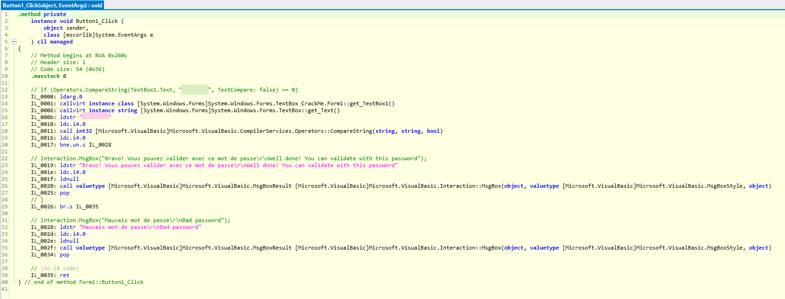
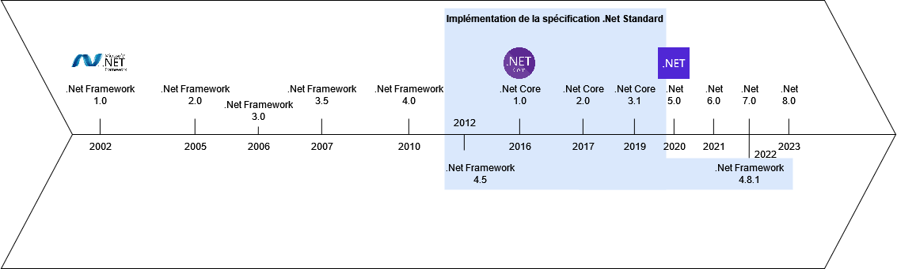
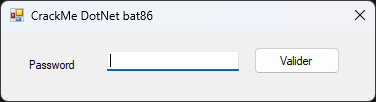
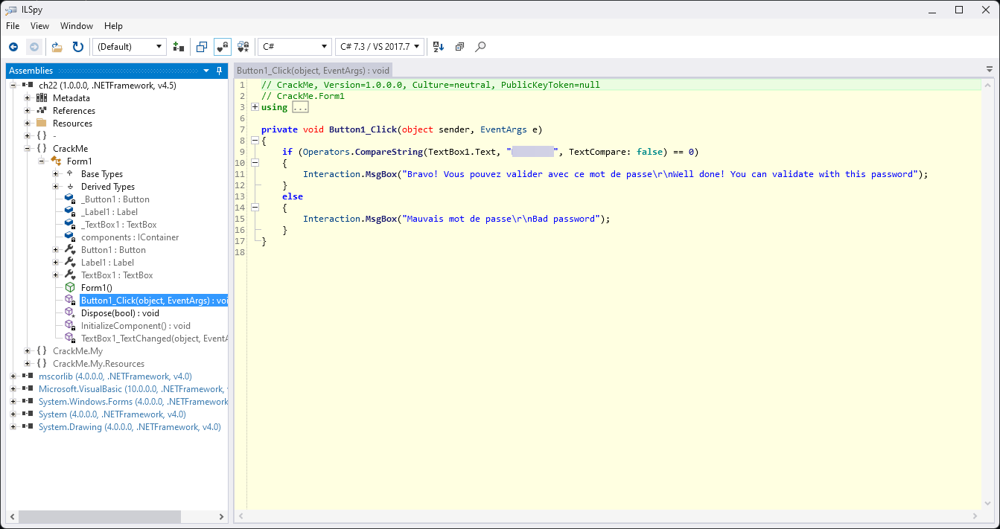
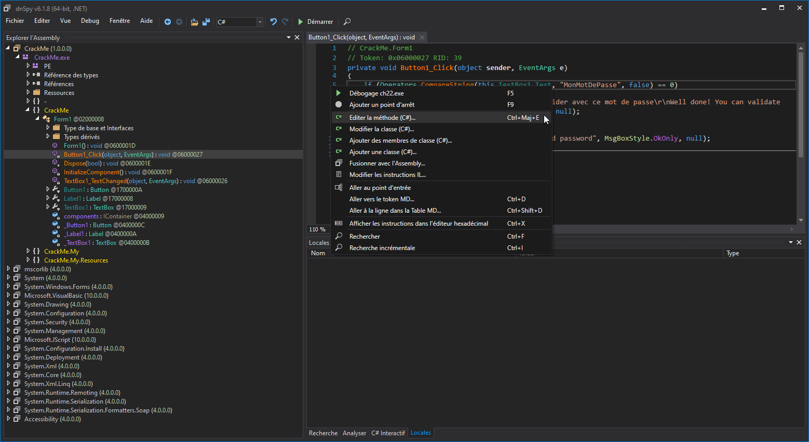

# .Net Framework

# .Net
Le .Net (prononcer à l'anglaise : "dot net") est une technologie développée par Microsoft. C'est un framework qui vise à aider au développement d'applications de tous types (GUI, CLI, web...) initialement exclusivement pour Windows.  
Il est connu pour aller de paire avec son IDE **Visual Studio** qui permet de réaliser des interfaces graphiques à l'aide de glisser/déposer simple à prendre en main. Les deux langages principaux reposant sur le .Net Framework sont le VB.Net (ne pas confondre avec VBA ou VB 6) et le C# (à ne pas confondre avec le C ou C++ car celui-ci tient beaucoup plus de **Java** que de ses homonymes).

Un programme codé en .Net nécessite que .Net soit installé sur la machine pour fonctionner. .Net est donc à la fois le framework de développement et l'interpréteur qui va permettre d'exécuter le code du programme (on parle ici de machine virtuelle .Net de la même manière qu'un programme Java a besoin de sa Java Virtual Machine).

Autrefois, le .Net ne s'installait que sur Windows mais Microsoft a changé son fusil d'épaule avec une refonte du .Net qui l'a rendu cross-platform. Une solution open source et cross-platform est également apparue : **Mono**

Dans le cadre du reverse engineering, le .Net est une aubaine. De par sa nature de langage pré-compilé, il nous permet de lire son code intermédiaire IL (**Intermediate Language**) et de le convertir en un langage .Net comme le C# ou le VB.Net. Le **IL** est à comparer au langage Assembleur mais qui embarquerait suffisamment d'informations pour permettre de réécrire le code source. On retrouve, entre autres, le nom d'origine des variables et fonctions.

Un exemple de code IL avec la correspondance C# notée en commentaire :



# .Net Framework, .Net Core, .Net, Mono et tout le reste ?
Si vous vous êtes déjà intéressé au .Net même de loin, vous vous êtes certainement perdu dans la multitude de dénominations pour désigner cette technologie. Voici un petit récap chronologique :

- .Net Framework : framework initial qui va de la version 1.0 à 4.8
- .Net Core : refonte du .Net framework avec le cross-platform en vue, va de la version 1.0 à 3.1
- .Net : suite du .Net Core ayant pour volonté d'unifier .Net Framework et Core sous le même nom. Va de la version 5.0 à 8 (en 2023). On note le commencement à la version 5 comme s'il s'agissait d'une prolongation du .Net Framework 4.8 alors qu'il tient en réalité du .Net Core (vous suivez ?)
- .Net Standard : Spécification destinée à uniformiser le .Net Framework et le .Net Core. Le .Net (à partir de la version 5.0) n'est pas concerné par l'implémentation de cette spécification. Pour ne rien simplifier, cette spécification a également des numéros de versions de la 1.0 à 2.1 mais on va surtout retenir que c'est une norme et pas un framework à proprement parler.
- Mono : Alternative open source et cross-plateform au **.Net Framework**. Très utilisé dans les moteurs de jeux-vidéos (ex : Unity, Godot). (presque entièrement) Compatible jusqu'à la version .Net Framework 4.7 début 2024.




# Lecture / modifications définitives
Les outils les plus simples à utiliser sont ceux qui proposent de lire et de patcher l'**Intermediate Language**. Pour simplifier la lecture, ces outils traduisent l'IL en C# ou VB. On peut ainsi lire le code du programme quasiment à l'identique de son code source et le patcher pour altérer son fonctionnement.

Exemple avec un crack-me basic écrit en .Net Framework 4.5 ouvert dans **ILSpy** :




Le vue du code nous permet de voir le code derrière le bouton "Valider". Si le texte de la boite de texte (TextBox1) est égal au texte flouté, on a entré le bon mot de passe.  
Le texte est volontairement flouté car le site d'où vient le challenge interdit de donner les réponses.

Le même exemple en utilisant **dnSpy** qui permet l'édition (patch) des programmes .Net :



# Patch au lancement d'un programme .Net
_Patch en runtime ou Monkey patching_
Une autre solution pour modifier le comportement d'un programme .Net est de patcher son code au moment de son chargement en mémoire. Ainsi le fichier d'origine n'est pas altéré mais son fonctionnement le sera.

Cette méthode est très utilisée pour le modding de jeux-vidéos écrit en .Net (habituellement, reposant sur les bibliothèques Mono) car cela permet de distribuer une DLL contenant le code à patcher au lieu d'avoir à distribuer les fichiers du jeu patchés de façon permanente.
Distribuer les fichiers directement patchés ne permettent pas d'avoir plusieurs mods en même temps et de toute manière, la diffusion de fichiers soumis à copyright est interdite.

La DLL du mod est ensuite chargée par le chargeur de mods et les patchs qu'elle contient sont appliqués sur le code du jeu.
Parmi les chargeurs de mods .Net célèbres, on retrouve [BepInEx](https://github.com/BepInEx/BepInEx) qui met à disposition une [version modifiée de Harmony](https://github.com/BepInEx/HarmonyX) à importer dans ses projets de mods.

## A quoi ça ressemble concrètement ?
Pour ce mode de fonctionnement, nous devons créer un projet .Net qui va contenir les instructions de patch à appliquer.
En utilisant Harmony, on va avoir la possibilité de cibler des fonctions spécifiques du programme et d'ajouter du code avant, après, au milieu ou de remplacer totalement le contenu de la fonction.

Exemple commenté provenant de la documentation de [Harmony](https://github.com/pardeike/Harmony/wiki) :
```C#
using System;
using Verse;
using Harmony;
using System.Reflection;

namespace HarmonyTest
{
    [StaticConstructorOnStartup]
    class Main
    {
        static Main()
        {
            // On doit donner un nom unique à notre mod pour permettre aux autres mods de spécifier s'ils
            // veulent s'exécuter avant ou après notre mod (par exemple : si un autre mod est dépendant du notre)
            var harmony = HarmonyInstance.Create("com.github.harmony.rimworld.mod.example");

            // On dit à Harmony de chercher dans le code actuel toutes les classes annotées comme "Patch"
            harmony.PatchAll(Assembly.GetExecutingAssembly());
        }
    }


    // On annote notre classe avec les décorateur de Patch
    // On cible la classe à patcher en précisant son type
    [HarmonyPatch(typeof(WindowStack))]
    // On cible la méthode que l'on veut patcher
    [HarmonyPatch("Add")]
    // On cible la méthode ayant en paramètre un objet de type "Window" (en cas de surcharge de méthode)
    [HarmonyPatch(new Type[] { typeof(Window) })]
    // Le nom de notre classe de Patch importe peu, les décorateurs font foi
    class Patch
    {
        // On créé une fonction qui porte le nom de l'opération à effectuer ainsi que les paramètres d'origine.
        // Types d'opérations les plus utilisés :
        // Prefix : le code de la fonction sera déclenché avant le code d'origine
        // Postfix : le code de la fonction sera déclenché après le code d'origine
        static void Prefix(Window window)
        {
            // Ici, on va logger l'objet "window" chaque fois que la fonction "Window.Add(window)" est appelée
            // avant que le reste du code de la fonction ne soit exécuté
            Log.Warning("Window: " + window);
        }
    }
}
```
