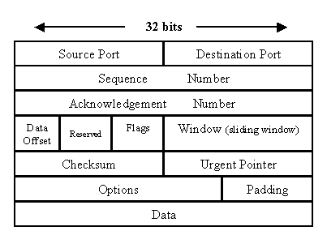
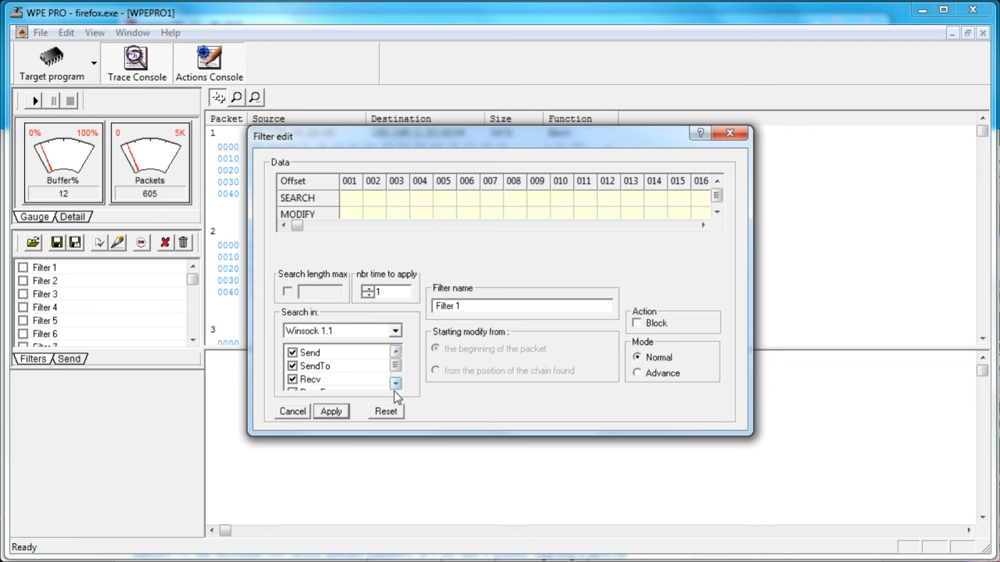

# Packet Editing

# Principe
Lors d'un échange entre un processus sur un ordinateur et un processus sur un serveur (ex : mise à jour Windows, connexion à un jeu en ligne, etc), il est possible de lire/modifier/bloquer ou réémettre les paquets TCP qui sont échangés. On peut ainsi modifier les paquets reçus sur un processus spécifique pour modifier le comportement du programme.

## Exemple commun pour un crack de logiciel

Workflow d'un crack

1. (lancement d'un logiciel à licence)
1. CLIENT : envoie une demande au serveur pour savoir si le logiciel est activé
1. SERVEUR : renvoie que nous n'avons pas de licence
1. CLIENT : interception du paquet sur notre ordinateur et modification pour indiquer que l'on possède la licence avant de le renvoyer au processus
1. CLIENT : le logiciel considère que la licence est active et se lance

## Paquets TCP
La partie qui nous intéresse est la partie **Data** tout en bas car ce sont les données écrites par le processus émetteur que le processus destinataire va devoir lire et interpréter.  
Il peut y avoir n'importe quelle donnée dans cette section suivant ce que le développeur a juger nécessaire d'échanger entre le client et le serveur.  

## Modification des paquets processus à la volée
On modifie le contenu du paquet en remplaçant des octets dans les données au format hexadécimal (section **Data**). La ligne **SEARCH** indique la valeur à chercher dans un octet précis et la ligne **MODIFY** indique la valeur à écrire en remplacement :

