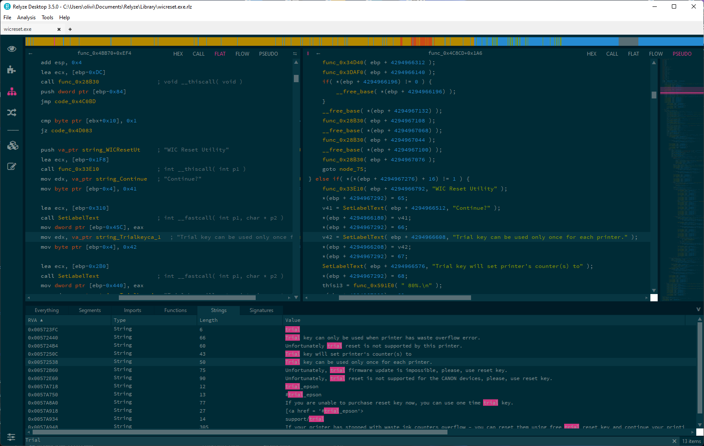
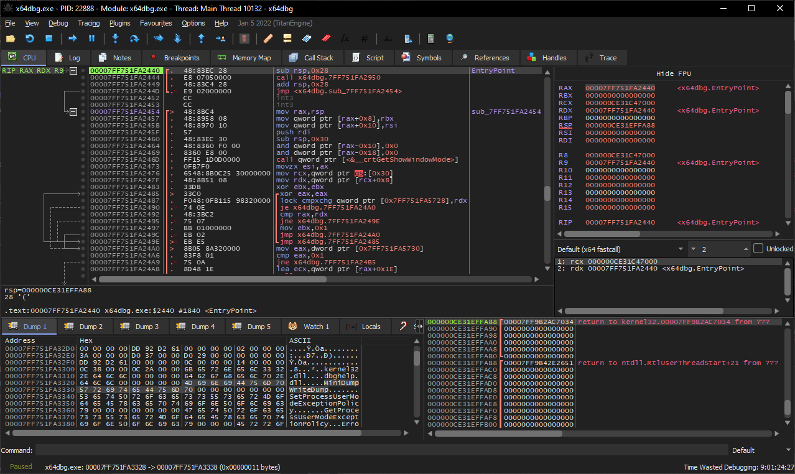

# Disassembler
## Relyze Desktop (gratuit)
* https://www.relyze.com/overview.html

Permet de visualiser et patcher le code assembleur d'un programme. Son gros plus est la possibilité d'avoir une vue "pseudocode" en C qui peut aider à comprendre les instructions assembleurs.

# Debugger
## x64dbg (gratuit)
* https://github.com/x64dbg/x64dbg

Permet de lancer un programme et de visualiser son code assembleur, sa mémoire et plein d'autres choses.

Des plugins permettent d'exporter des patchs.

