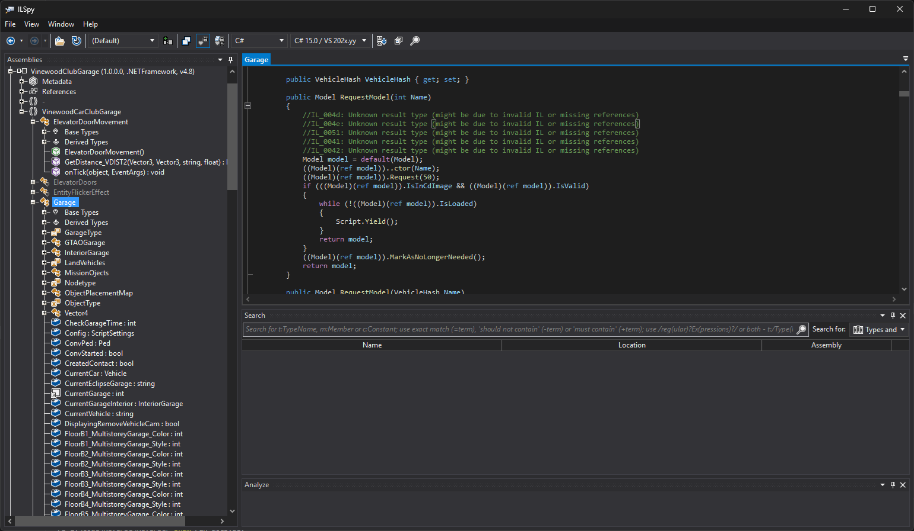
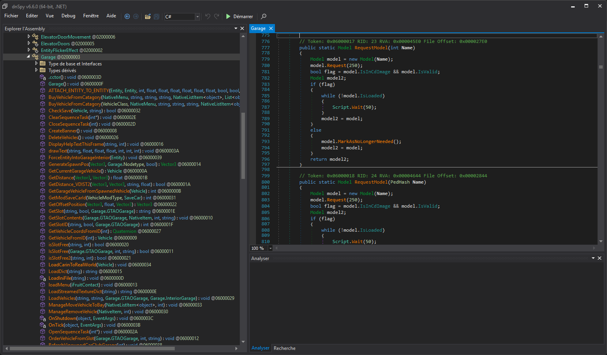

# .Net

## ILSpy

::: tip
Lien officiel : [ILSpy](https://github.com/icsharpcode/ILSpy)

Très efficace pour lire un Assembly .Net, il reste la référence.
:::

- Langues supportées : Anglais, Chinois
- Langages de désassemblages : C# (toutes versions), IL, IL (avec code C# en commentaire de chaque instruction)
- ✅ Tenu à jour
- ✅ Permet d'exporter le code d'un Assembly .Net sous forme de projet C#
- ✅ Supporte les nouvelles versions de C# pour exporter un code utilisant les nouvelles normes d'écriture
- ✅ Supporte l'analyse des membres et fonctions pour voir où ils sont lus/écris/instanciés
- ❌ Ne permet pas l'édition du code (il faut exporter, charger le projet dans Visual Studio, le modifier et le compiler)

## dnSpy

::: tip
Lien officiel : [dnSpyEx](https://github.com/dnSpyEx/dnSpy) (fork à jour de [dnSpy](https://github.com/dnSpy/dnSpy))

Interface un peu plus sympa que ILSpy mais son gros point fort est de permettre **l'édition du code**.
:::

- Langues supportées : Multi langues
- Langages de désassemblages : C#, VB, IL
- Repose sur **ILSpy**
- ✅ Tenu à jour
- ✅ Permet d'exporter le code d'un Assembly .Net sous forme de projet C#
- ✅ Supporte les nouvelles versions de C# pour exporter un code utilisant les nouvelles normes d'écriture
- ✅ Supporte l'analyse des membres et fonctions pour voir où ils sont lus/écris/instanciés
- ✅ Permet l'édition du code et l'enregistrement de l'assembly

