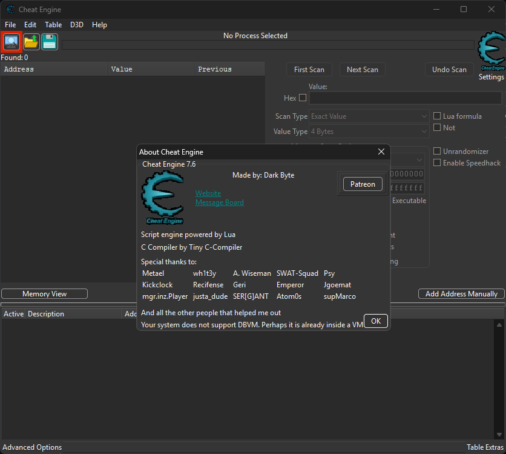
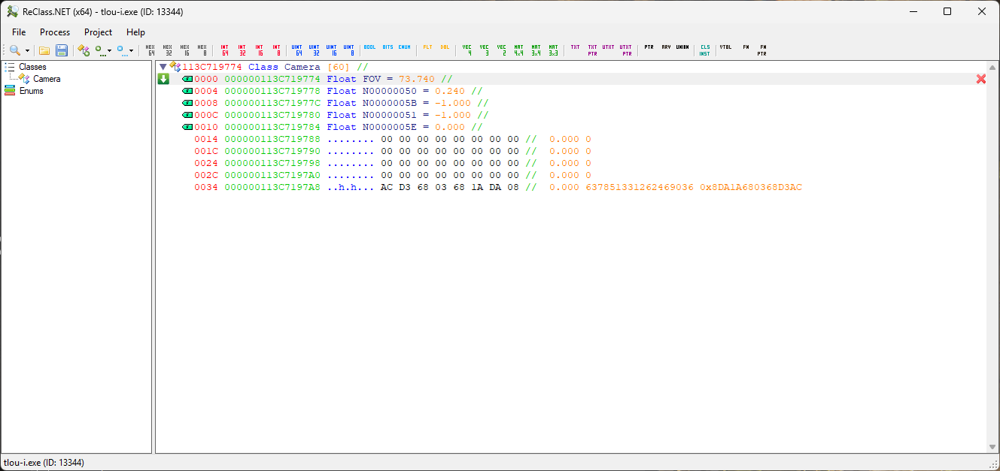

# Memory Editors

## Cheat Engine

::: tip
Lien officiel : https://cheatengine.org/

Forum : https://forum.cheatengine.org/

Le plus connu et le plus polyvalent. Permet de rechercher des valeurs en mémoire, de debugger le code assembleur et de le patcher en direct.
:::

## ReClass.NET

::: warning Attention
N'est plus tenu à jour
:::

::: tip
Lien officiel : https://github.com/reclassnet/reclass.net

Propose des fonctionnalités similaires à Cheat Engine dont il reprend l'interface de recherche de valeurs mais permet de visualiser les données avec une logique de `structure`. On créé une structure avec une adresse mémoire de base et ReClass va afficher les X adresses suivantes avec ce que donneraient leurs valeurs dans différents types (notamment `float`, `double`, `int64` et `int64 (hexa)`)  de notre choix. C'est utile lorsque l'on a une adresse mémoire qui pointe sur une structure et que l'on veut plus facilement la parcourir.

La mention `.NET` dans son nom fait référence au fait que c'est un fork réécrit en .Net. Ce programme fonctionne bien avec tous les processus Windows.
:::

