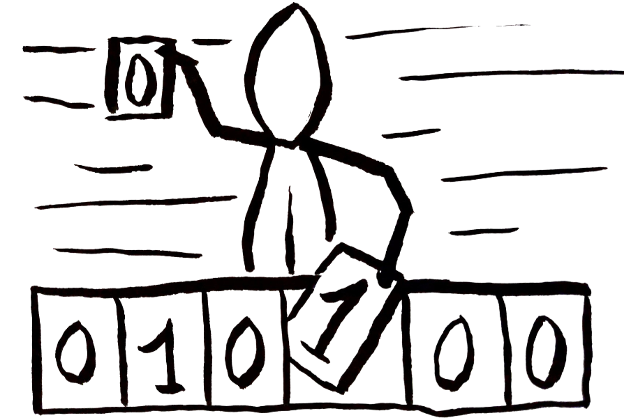
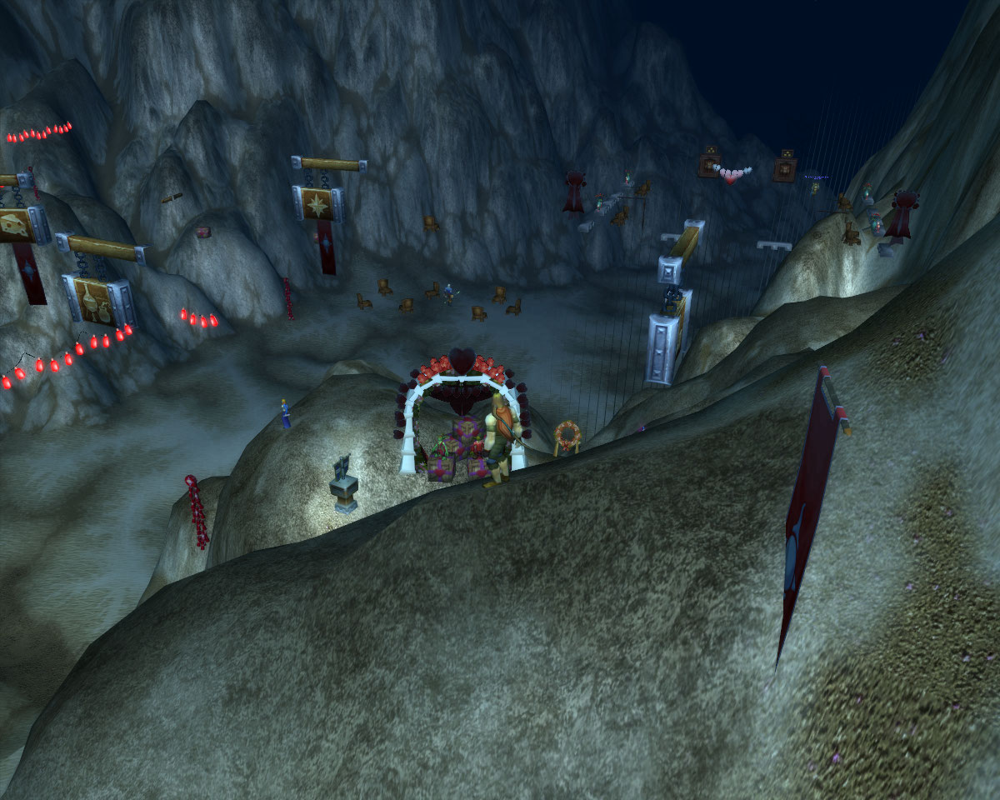
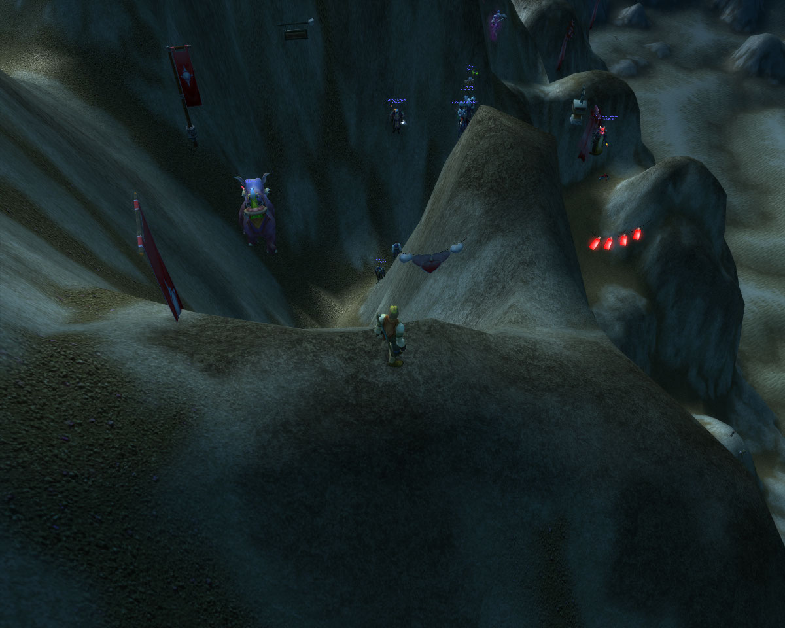
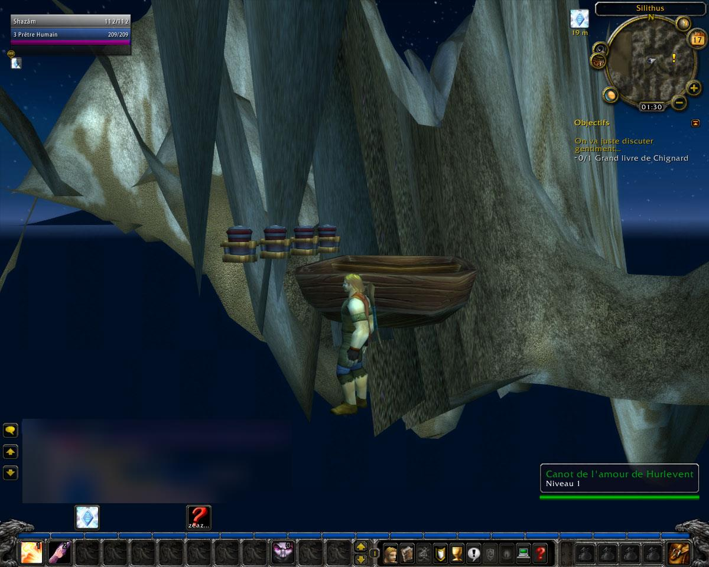

# Remplacement de la carte du monde

::: info
Cette revue est écrite bien des années après sa réalisation. Le logiciel `WPE Pro` utilisé ici n'est absolument plus fonctionnel sur les versions récentes de Windows et je n'ai pas pensé à faire de captures du logiciel à l'époque pour montrer ce que je faisais exactement.
:::

## Contexte

- Date : Février 2010
- Programme : Wow (serveur officiel) - Event St-Valentin
- Version : 3.3.2
- Outils utilisés : `WPE Pro`

## Objectif

Modifier l'id de map envoyé par le serveur vers notre client pour le remplacer et en charger une autre à la place.

## Hypothèses initiales

C'est le serveur qui stock les données du personnage, son apparence, son équipement, et surtout ses coordonnées et la carte sur laquelle il se trouve (en tout cas, **l'ID de la carte** et notre client fait le lien tout seul avec les fichiers à charger).

Il nous envoie ces informations à la connexion pour que notre client charge les bons modèles 3D, la bonne carte, etc.

Donc logiquement, on doit pouvoir intercepter les paquets réseaux contenant ces données et les modifier avant que notre client ne les lises. De cette manière on doit pouvoir changer la carte sur laquelle on apparait.

Ça ne pourra être que visuel ! Tout ce qui est géré côté serveur (autres joueurs, NPC, objets avec intéractions, etc.) resteront ceux de la vraie carte. Mais déjà c'est cool.

::: tip Workflow de connexion simplifié
1. (choix du personnage)
1. CLIENT : clic sur le bouton de connexion du personnage
1. SERVEUR : envoie la carte sur laquelle se trouve le personnage, sa position, son stuff, etc
1. CLIENT : charge la carte correspondante, place le joueur, l'équipe, etc

Il faudra intervenir entre les étapes 3 et 4 pour altérer ce que le serveur nous envoie et faire croire au client que notre joueur est sur une carte totalement différente.
:::

## Méthode

### 1. Observation initiale

Il faut commencer par connaître l'ID de la carte sur laquelle on se trouve et l'ID de celle où on veut aller. Dans mon cas mon personnage se trouvais dans les **Royaumes de l'Est** et je voulais simplement remplacer la carte par **Kalimdor** :

::: tip Liste des id de quelques maps (voir la section [Références](#references) pour plus)
| ID  | Nom               |
| --- | ----------------- |
| 0   | Royaumes de l'Est |
| 1   | Kalimdor          |
| 530 | Outreterre        |
| 571 | Norfendre         |
::: 

### 2. Recherche de la donnée

Le plus dur est de trouver l'emplacement de l'id de map dans les données du paquet. Pour le retrouver, je me suis connecté plusieurs fois avec mes personnages depuis plusieurs maps différentes et j'ai cherché l'id de la map dans les données de paquets. Les **Royaumes de l'Est** et **Kalimdor** sont de mauvais candidats car leurs id sont respectivement **0** et **1**, inutile de dire que c'est une valeur très répandue dans un paquet.
Les id de l'**Outreterre** et de **Norfendre** sont plus spécifiques et font ressortir moins de paquets contenant ces valeurs. En continuant de chercher, on fini par comprendre quel paquet s'occupe d'envoyer l'id de la map et où se trouve la valeur pour la modifier.  

Par chance, les données n'étaient pas chiffrée ! Si les données étaient chiffrées et devaient être déchiffrées par le client, je n'aurais rien pu faire car modifier 1 octet du paquet aurait fausser toute la chaîne, le rendant illisible par le jeu. Il aurait été nécessaire de déchiffrer les données et les rechiffrer derrière, sans connaître l'algo utilisé ni les clefs ni rien...

### 3. Modification

Le personnage se trouve à Hurlevent (carte **Royaume de l'est**, id **0**) et le filtre remplaçait simplement l'id **0** par l'id **1** (**Kalimdor**).

Les paquets sont compartimentés avec des tailles bien définies, on applique un filtre dans `WPE Pro` qui va écraser un octet précis par la valeur que l'on veut.

C'est comme dire : "Ecrase moi le 12ème octet du paquet par la valeur **1**" (voir la section [Références](#references) pour plus d'informations sur l'édition de paquets)

## Résultat

On se retrouve donc sur la carte demandée mais avec les objets serveurs des **Royaumes de l'Est** (panneaux, chaises, caisses, joueurs, pnj, etc) car le serveur sait que l'on est là bas, et la carte de **Kalimdor** chargée sur notre client.
Il y a une disparité entre ce que le client croit et ce que le serveur sait et nous envoie.

On notera que notre jeu (client) nous affiche à Silithus car notre position réelle (à Hurlevent) se trouve aux même coordonnées que Silithus.

## Ce que j'en retiens

Maintenant que j'y pense, j'aurais dû charger une map plus cool que Kalimdor. Comme le rêve d'émeraude qui était inacessible aux joueurs...

Après il fallait que les coordonnées de mon joueur collent avec les coordonnées de la carte de destination. Il ne faut pas que mes coordonnées X et Y soient en dehors de la carte cible et il ne faut pas non plus que la coordonnées Z soit sous la carte cible, sinon c'est la mort assurée avec potentiellement une chute en boucle si le respawn est lui aussi sous la map cible.

## Références

- Petite explication théorique sur le packet editing : [Packet Editing](../../méthodes/packet-editing.md)
- Liste exhaustive des maps et leurs ID : https://wowpedia.fandom.com/wiki/InstanceID

