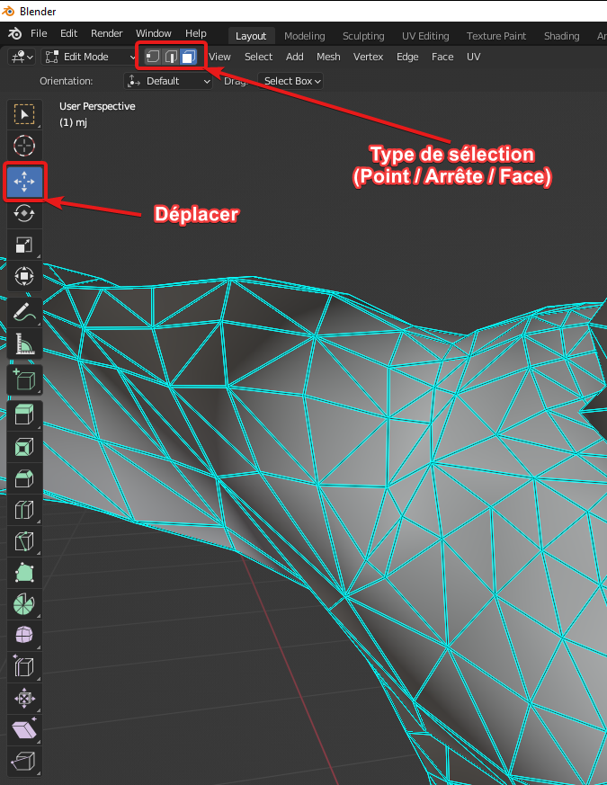
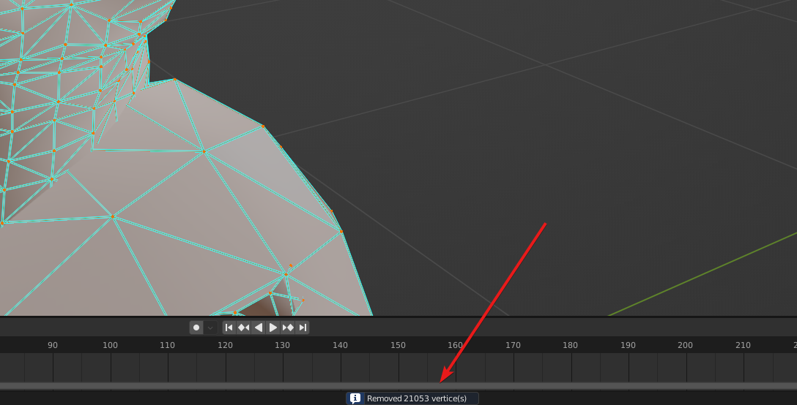
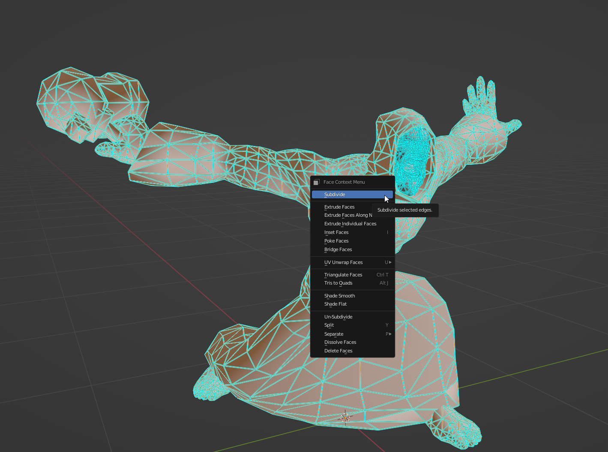
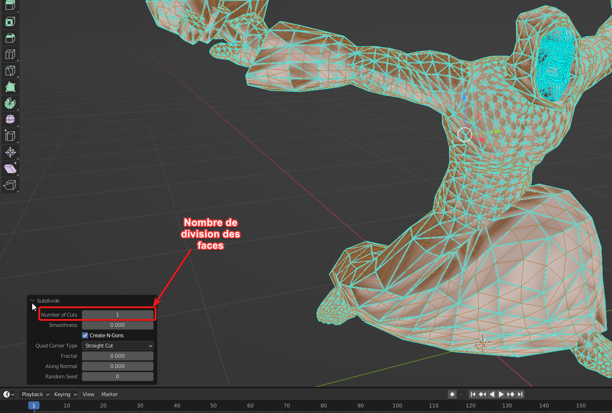
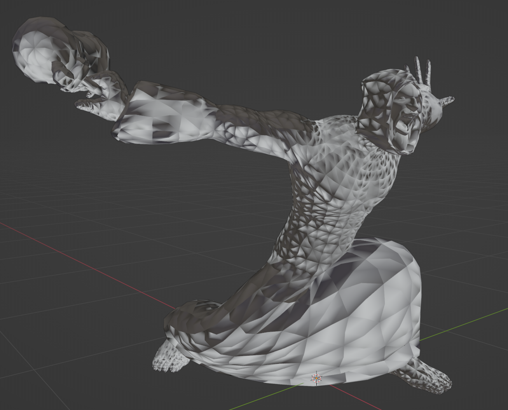
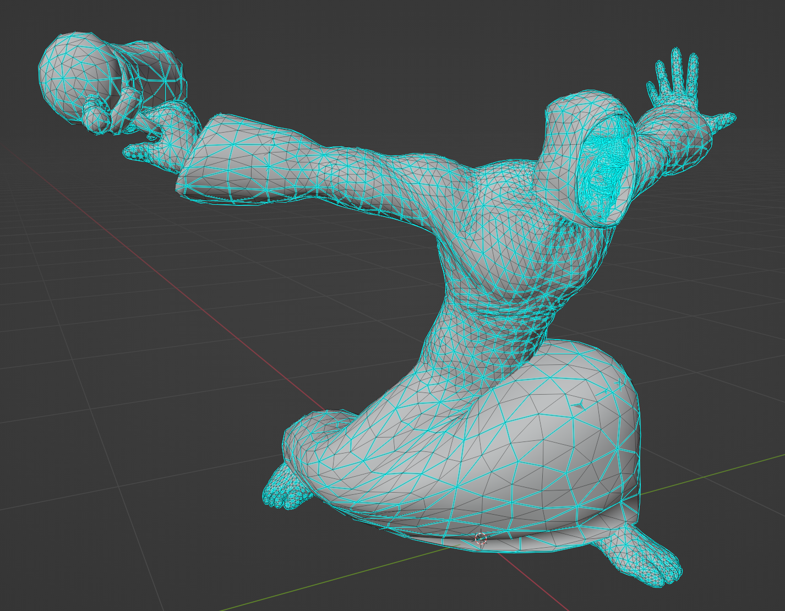

# Conversion d'un modèle .M2 vers .STL

Conversion d'un modèle 3D issu du jeu World of Warcraft vers un format imprimable en 3D.

# Prérequis
- Commencer par télécharger le jeu dans sa dernière version (créer un compte d'essai gratuit si nécessaire) :
  - https://worldofwarcraft.com/fr-fr/start
- Wow Model Viewer dernière version impérativement :
  - https://wowmodelviewer.net/download/
- Blender :
  - https://www.blender.org/download/
- 3D Builder (ou votre slicer habituel) :
  - https://apps.microsoft.com/store/detail/3d-builder/9WZDNCRFJ3T6?hl=fr-fr&gl=FR
- WowHead (base de donnée d'objets dans Wow, permet de retrouver des items plus facilement que dans Wow Model Viewer) :
  - https://fr.wowhead.com/items

# Wow Model Viewer
## Utilisation
- Choisir un personnage (ou autre modèle 3D)
- Pour les personnages, prendre le nom qui se termine en **\_hd** et pas en **\_hd\_sdr** :  

## Export du modèle 3D
- Exporter le modèle au format **.obj** :  

# Blender
## Utilisation

### Général
| Commande | Description  |
| -------- | ------------ |
| Clic molette | Tourner la caméra |
| Maj+Clic molette | Bouger la caméra |

### Mode Édition
| Commande | Description  |
| -------- | ------------ |
| Maj+Sélectionner | Ajouter à la sélection |
| Ctrl+Sélectionner | Soustraire à la sélection |

## Import du modèle
- Commencer par supprimer le cube qui est créé par défaut
- Importer le modèle 3D exporté auparavant :  

## Correction du modèle
- Le modèle peut avoir des problèmes suite à l'export, pour vérifier ça, on passe en mode édition (Edit Mode), on se met en type de sélection "Face", on clic sur une face du modèle et on la déplace :  

- Un exemple de modèle corrompu (les faces ne sont pas reliées en elles) : 

- Pour corriger ce problème : 
  - Passer en mode de sélection "Points"
  - Faire "A" (*Sélectionner tous les points*)
  - Faire "M" (*Merge vertices*)
  - Faire "B" (*By distance*)
- Un message devrait apparaître pour confirmer la fusion des points qui sont superposés :  

- On déplace une face pour confirmer qu'elle est bien attachée au reste :  

## Lisser le modèle
- Sélectionner les faces que l'on veut lisser (voir tout sélectionner avec la touche "A")
- Ici je choisi tout sauf le visage qui est déjà très détaillé
- Faire clic-droit -> "Subdivide"

- Les options pour la division vont s'afficher en bas à gauche de l'écran :  

- Maintenant que le modèle a plus de faces, on peut les lisser (toujours avec les faces que l'ont veut lisser sélectionnées) :  

- "Mais ! Mon modèle est devenu tout dégueulasse en rendu !"  

- Alors déjà ça donne un style, et ensuite oui mais c'est facilement fixable ! Ce sont les normales des faces qui ne sont plus correctement alignées et donc le calcul des ombres se fait mal
  - Sélectionner toutes les faces du modèle
  - Menu "Mesh" -> "Normals" -> "Recalculate Outside"
  - Puis menu "Mesh" -> "Normals" -> "Set from faces"

- ~A noter que ceci ne gêne en rien pour l'impression, c'est seulement gênant dans les moteurs de rendu 3D qui ont besoin des normales pour calculer des effets~ EDIT : ⚠️ C'est bien un paramètre dont les slicer tiennent compte pour l'impression ! Il est important de corriger le sens des normales avant l'export.

- Résultat du lissage :  

## Exporter le modèle au format STL

Il faut maintenant exporter le modèle depuis Blender et l'importer dans 3D Builder pour qu'il soit préparé à l'impression et mis aux dimensions voulues

### Blender

### 3D Builder
- Importer le modèle STL dans 3D Builder
- Cliquer sur le warning de correction du modèle qui apparaît en bas à droite :  

Le modèle peut être déformé après la correction effectuée, vérifier s'il est toujours correct.

- Cliquer sur le modèle pour le redimensionner :  

- Une autre option intéressante du logiciel est de rendre le modèle creux :  

