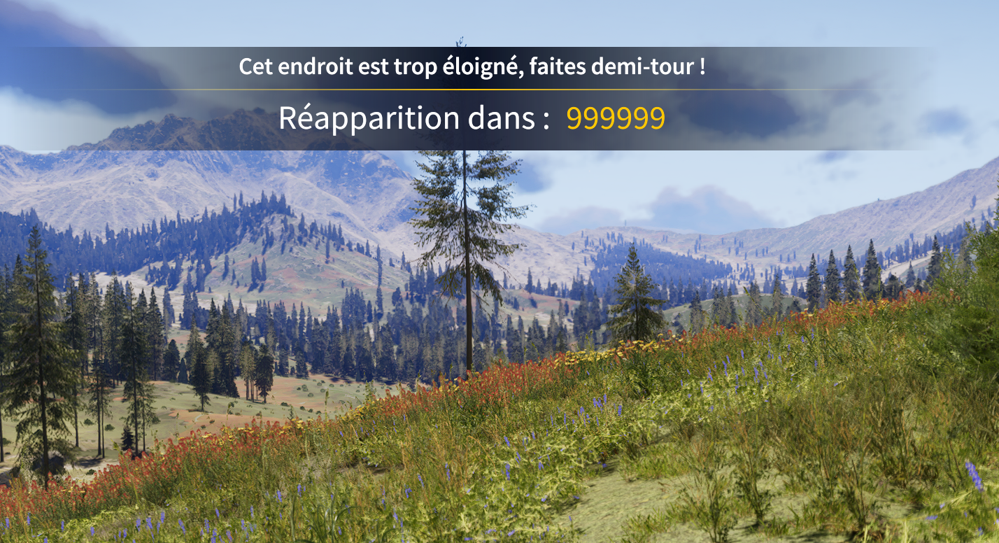
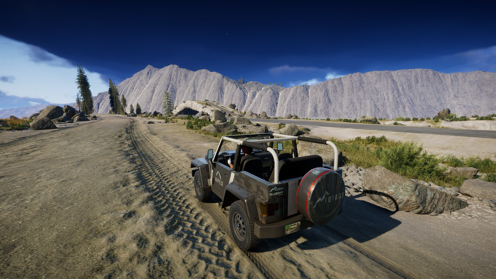
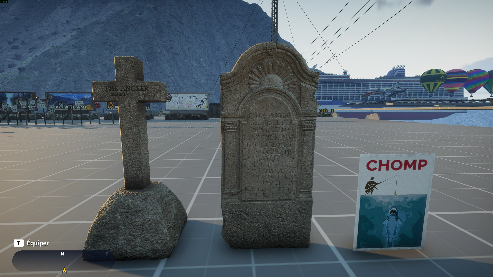
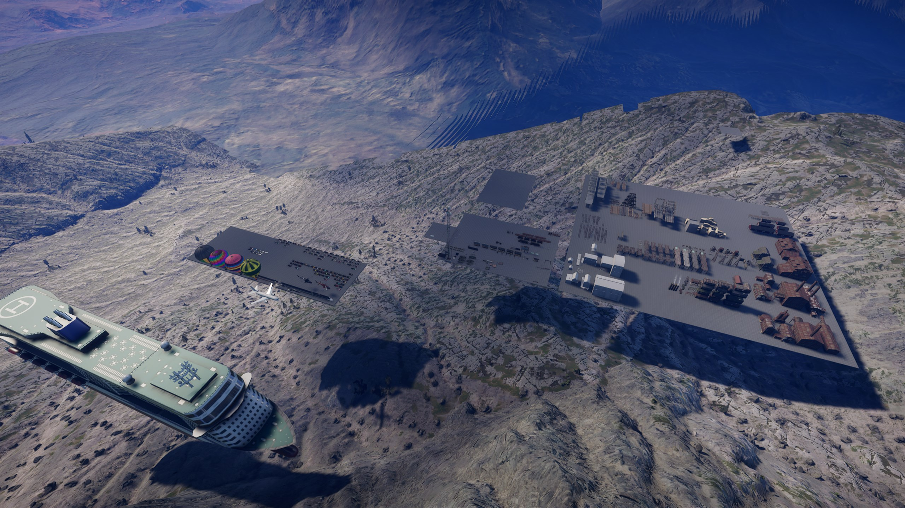
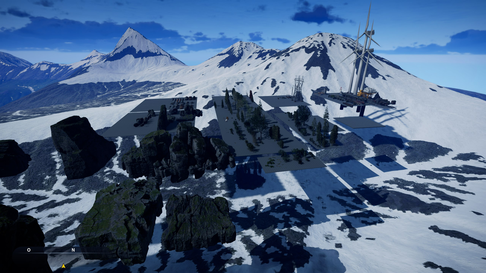
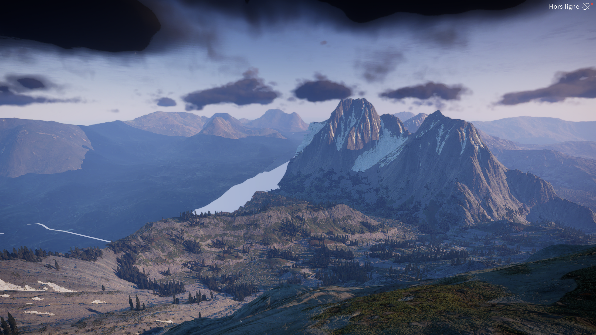
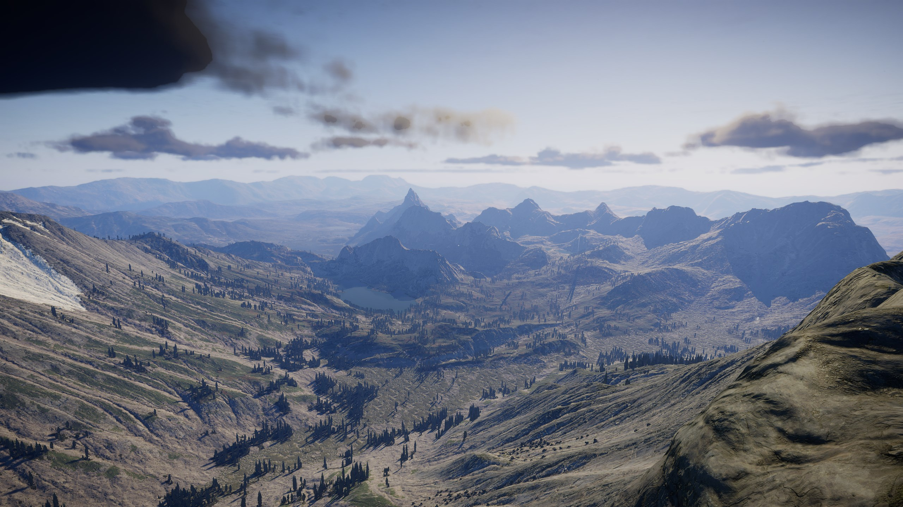
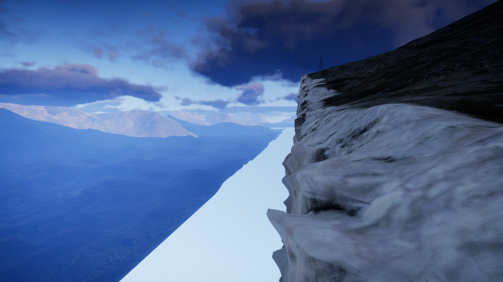
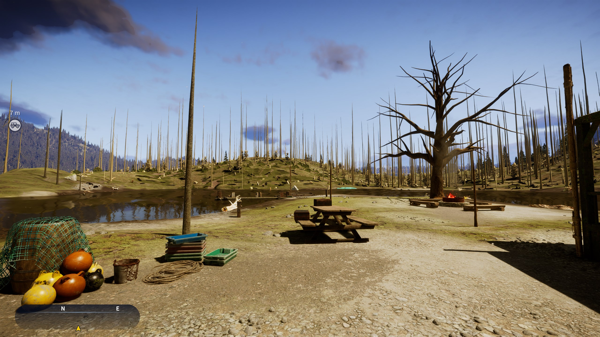

::: danger WIP
En cours
:::

# Bidouilles sur Call of the Wild - The Angler

## Contexte

- Date : Juillet 2024
- Programme : Call of the Wild - The Angler
- Version : _inconnue_
- Outils utilisés : [Cheat Engine](../../outils/memory-editors/index.md)

## Objectif

Mon objectif initial était de trouver un moyen de sortir de la carte. Lorsque l'on essaye de sortir de la zone de jeu, un timer de quelques secondes se déclenche et on est téléporté en arrière.

## Hypothèses initiales

En explorant un peu les fichiers du jeu, je suis tombé sur la heightmap de la première carte du jeu et un détail m'a intrigué :

===> Retrouver la height map montrant la test track

## Méthode

### 1. Observation initiale

### 2. Recherche de la donnée

### 3. Analyse du code

### 4. Modification ou patch

J'avais pu modifier le temps disponible sur le timer mais c'était infernal car il faisait un _bip bip_ en permanence ! Il fallait que je trouve un moyen de le virer totalement.

Après pas mal de recherche dans le code assembleur, j'ai pu retrouver les instructions qui appellent la fonction de timer et les supprimer complètement, j'étais enfin libre d'explorer en toute tranquillité !

## Résultat

::: info Piste de test des jeeps
La raison pour laquelle je voulais sortir de la map ! Bon au final ce n'est pas très excitant en soit mais c'est grâce à elle que j'ai pu voir tout le reste !

_Vue de dessous, c'était l'occasion de voir comment modifier ma vélocité en saut pour pouvoir sauter dessus (modifier ma coordonnées Z n'était pas efficace sur ce jeu)._

_Il y avait un spawner de véhicules comme on en trouve partout en jeu._
:::

::: info Zone de test des objets
Je ne sais pas encore si ces zones servaient juste à tester les modèles (ça m'étonnerait) ou si c'est une façon de les faire charger au jeu en une fois au chargement de la map et éviter les freeze si un modèle se ferait charger plus tard (par exemple un joueur qui spawn une voiture avec une couleur que l'on avait pas encore croisé). J'ai déjà vu ce système d'objets déjà créés en dehors de la map qui se retrouvent ensuite instanciés au besoin dans certains moteurs de jeux (oui je parle de toi Construct2) donc je penche plus pour un genre de cache.

_Fun fact : sur ce genre de plateforme j'ai pu voir en avant première les reposes cannes qui ont été introduits quelques mois plus tard en jeu, wow !_

_Ceux là sont clairement des bâtiments de test ou qui n'ont jamais été terminé._

_Il faudrait que je retourne voir cette croix maintenant que le jeu a officiellement été stoppé._

_Update Août 2026 : et bien non, pas de changement_ 😕

_Vues d'ensemble_

_Oui, c'est un ferry qui vole. Le plus étonnant étant que cette carte n'a pas ce genre de bateau, ni le train ni plusieurs autres modèles. Je pense que cette carte servait aussi de test pour les développeurs. C'est la toute première map sortie avec le jeu, celles qui ont suivies étaient des DLC._
:::

::: info Autres curiosités

_Les autres cartes aussi ont eu droit à leurs zones de tests._

_Mon bateau s'est envolé, tout droit à la verticale, après que j'ai joué avec les valeurs d'aérodynamisme_ 🤷‍♂️

_De très beaux paysages même en dehors de la map._

_La bordure de la map._

_La modif sauvage des valeurs de rendu 3D ont fait tomber les feuilles des arbres... Initialement je cherchais à désactiver le rendu de l'eau pour voir les poissons._
:::

### Ce qui a fonctionné

J'ai pu sortir de la map et explorer les zones de test des développeurs, c'était très cool !

Heureusement que des utilitaires pour lire les fichiers du jeu existent pour me permettre de mieux comprendre la structure des données et les retrouver en mémoire.

###  Limites

## Ce que j'en retiens

Je me dis que pour avoir réussi à passer autant de temps et d'énergie à tordre ce jeu, j'ai vraiment dû beaucoup l'aimer ! 240h cumulées entre le vrai jeu et la bidouille **en jeu** (je ne compte pas le temps passé à faire des recherches en dehors).

## Références

